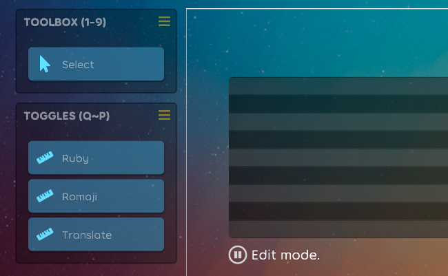

## Beatmap

- Move to translate property into `KraokeBeatmap`. [karaoke](#174@andy840119)
- Update beatmap statistic icon. [karaoke](#162@andy840119)

## Code quality
- Rewrite some test cases. [karaoke](#182@andy840119)
- Remove legacy ruleset id. [karaoke](#173@andy840119)

## Editor

- Apply blueprint change from the official. [karaoke](#181@andy840119)
- Able to show/hide ruby, romaji, and translate in editor page. [karaoke](#170@andy840119)

## Framework
- Update `ppy.osu.Game` to `2020.925.0`. [karaoke](#180@andy840119)

## Fix
- Fix cannot open setting dialog if not in practice mode. [karaoke](#168@andy840119)

## Result

- Fix cannot display the result screen. [karaoke](#172@andy840119)
- Display not scorable if the beatmap is not scorable. [karaoke](#176@andy840119)