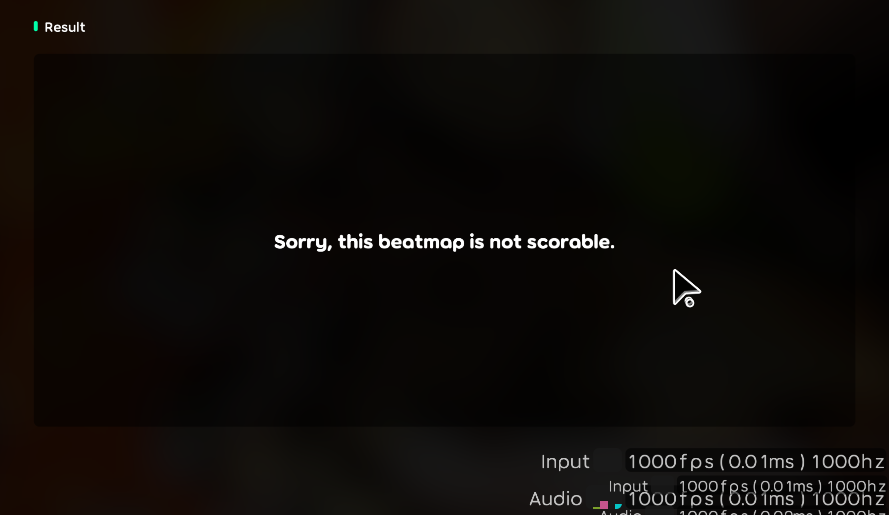
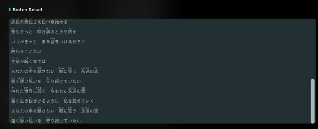

## Achievement

- \雙十節/
- Become the first one to update the latest package version.

## Beatmap

- Define sub-singer. [karaoke](#141@andy840119)
- Enable to add singer in the beatmap. [karaoke](#191@andy840119)
- Enable to remove singer in the beatmap. [karaoke](#198@andy840119)

## Result

- Implement beatmap infos display on the result page. [karaoke](#187@andy840119)
- Implement beatmap metadata statistics on the result page.

- Implement not scorable graph. [karaoke](#188@andy840119)

- Implement saiten result component in the result page(haven't been fully implemented). [karaoke](#179@andy840119)
