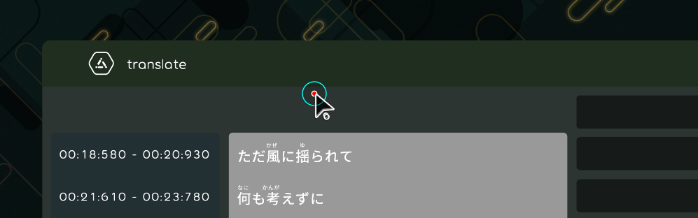

## Achievement
- Create some basic edit areas.
- Got a new star and pull request. [karaoke](#220@Yoyolick)

## Code quality
- Running clean-up code script. [karaoke](#207@andy840119)

## Editor

- Let lyric maker's lyric draggable. [karaoke](#199@andy840119)

- Re-write translate editor. [karaoke](#157@andy840119)

- Re-write ruby/romaji editor. [karaoke](#213@andy840119)

## Skin Editor

- Re-write layout editor. [karaoke](#217@andy840119)

- Re-write style editor. [karaoke](#223@andy840119)