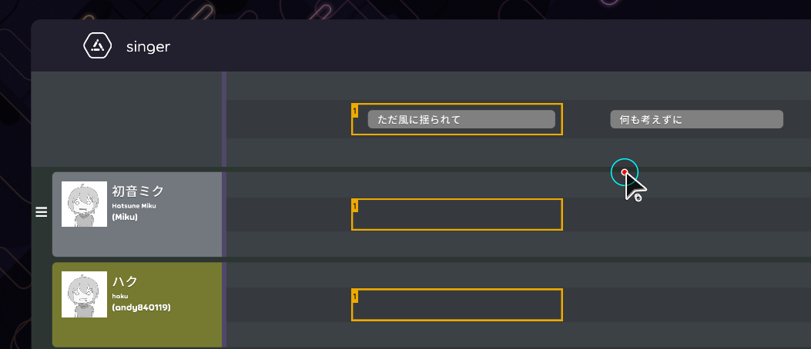

## Achievement

- Implement singer editor.

## Code quality

- Rename from `LyricLine` to `Lyric`. [karaoke](#227@andy840119)
- Save lists of singer index instead of font index in the lyric. [karaoke](#240@andy840119)

## Editor

- Implement drag `.lrc`/`.kar` file to import. [karaoke](#230@andy840119)
- Create import manager. [karaoke](#232@andy840119)
- Implement style editor [karaoke](#225@andy840119)
- Style editor can switch to edit between `Lyric` and `Note`. [karaoke](#233@andy840119)
- Implement singer editor, [here](https://youtu.be/Dc-M3jZO_LI)'s the demo video.
  - Base implementation. [karaoke](#234@andy840119)
  - Implement display lyric. [karaoke](#238@andy840119)
  - Enable right-click to assign singer. [karaoke](#241@andy840119)
