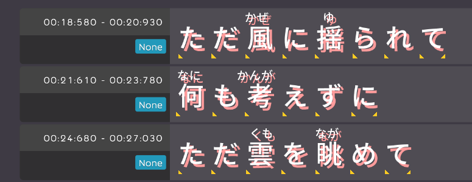

## Auto-Generator

- Implement auto-detect language in lyric importor. [karaoke](#264#271@andy840119)
- Create time-tag generator for Chinses lyric. [karaoke](#277@andy840119)
- Improve time-tag generator for Japanese lyric with ruby. [karaoke](#280@andy840119)

## Beatmap

- Implement Ruby and Romaji tag serializer, which allow to save them with better format. [karaoke](#281@andy840119)
- Implement tome tag serializer. [karaoke](#282@andy840119)
- Implement bindable dictionary for better control bindable with dictionary foramt. [karaoke](#292@andy840119)
- Use calture-Info instead of language id in translate. [karaoke](#293#298@andy840119)
- Change time tag from tuple to object. [karaoke](#300@andy840119)

## Blog

- Fix username alignment. [karaoke](#269@andy840119)

## Editor

- Implement remain step about import text as karaoke beatmap. [karaoke](#268#287@andy840119)

- Implement display time-tag in lyirc editor. [karaoke](#284#289@andy840119)

- New left-side style for better UX experiance.

## Utility

- Implement ruby/romaji tag checking utility. [karaoke](#276@andy840119)