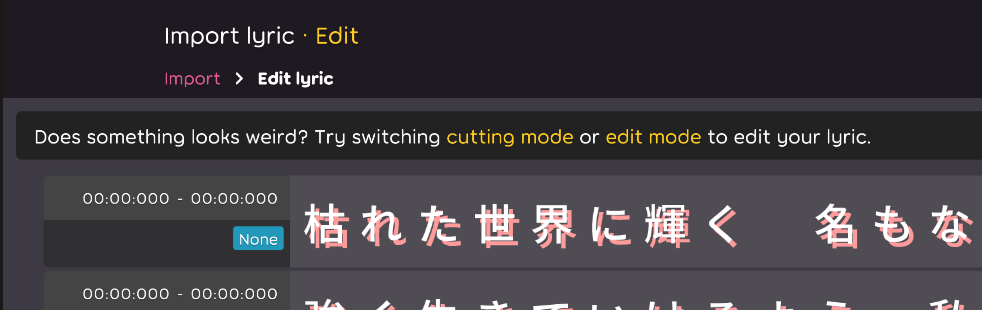

## Code quality

- Update config from how `lazer` have. [karaoke](#314@andy840119)

## Editor

- Implement cursor in the lyric editor. [karaoke](#299@andy840119)
- Implement click the time-tag to move the cursor. [karaoke](#302@andy840119)
- Press space to set the current time in time-tag. [karaoke](#304@andy840119)
- Able to split lyrics in the lyric editor. [karaoke](#312@andy840119)
- Create a state manager for managing cursor position or mode in the lyric editor. [karaoke](#316@andy840119)
- Enable to delete text by mouse position. [karaoke](#326@andy840119)
- Add `edit lyric` step in lyric import step. [karaoke](#327@andy840119)
  
- Let import navigation be interactable.

## Fix

- Using better regular expression to parse ruby, romaji, and time-tag. [karaoke](#305@andy840119)

## Performance

- Fix duplicated calculation in the lyric object. [karaoke](#310@andy840119)

## Utility

- Implement lyric utility to handle split and combine lyrics. [karaoke](#308@andy840119)
- Implement note utility to handle separate and combine notes. [karaoke](#313@andy840119)
- Add shifting time tag position in utility for delete lyric purpose. [karaoke](#330@andy840119)
