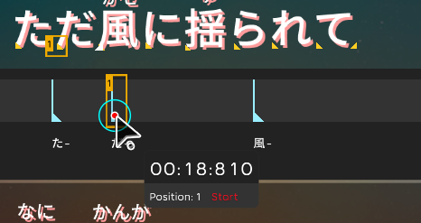
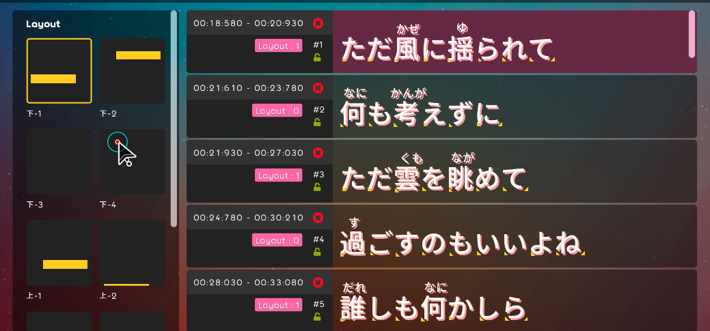
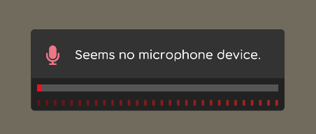
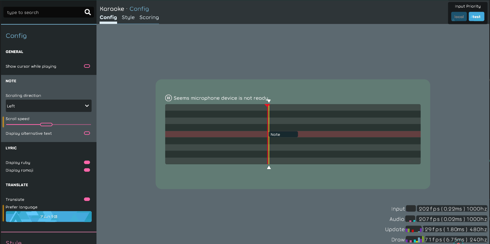

## Beatmap
- Add bindable start index and bindable end index into ruby / romaji tag object. [karaoke](#608#609@andy840119)
- Fix hover cause overlay hidden in lyric editor. [karaoke](#652@andy840119)

## Code quality
- Clean-up code and remove unused class. [karaoke](#617@andy840119)
- Make `StopClock` into individual class. [karaoke](#651@andy840119)

## Editor
- Able to drag to select ruby or romaji text tag in lyric editor. [karaoke](#610#613@andy840119)
- Implement time tag blueprint. [karaoke](#612@andy840119)
- Able to sync selected time-tag / text-tag in lyric maker. [karaoke](#614@andy840119)
- Show tooltip in overlay time-tag blueprint. [karaoke](#615@andy840119)    
  
- Should handle the invalid message from base issue class in the lyric editor. [karaoke](#616@andy840119)
- Drag to change ruby/romaji start/end index in lyric editor. [karaoke](#619@andy840119)
- Drag to change text tag position in lyric editor. [karaoke](#620@andy840119)
- Should have a selected highlight background if selected in lyric editor. [karaoke](#622#623@andy840119)
- Create extra edit spacing for editor if switch to some mode. [karaoke](#625@andy840119)
- Move edit `layout`/`single`/`language` into mode in lyric editor. [karaoke](#626@andy840119)
- Create base `section` class for collecting all relative `section` logic using in editor. [karaoke](#628@andy840119)
- Implement edit `ruby`/`romaji` tag space in the right side. [karaoke](#629@andy840119)    
  
- Implement singer section in lyric editor. [karaoke](#630@andy840119)    
  
- Implement layout section in lyric editor. [karaoke](#631@andy840119)    
  
- Fix delete ruby/romaji not delete ruby sometimes in utils. [karaoke](#632@andy840119)
- Remove legacy ruby romaji editor. [karaoke](#633@andy840119)
- Able to delete ruby/romaji tag in lyric editor. [karaoke](#635@andy840119)
- Stabilize caret hover/select logic in lyric editor. [karaoke](#636@andy840119)

## Setting
- Enable to config show/hide ruby/romaji in config page. [karaoke](#639#642@andy840119)
- Should implement no microphone style if user has no microphone. [karaoke](#643@andy840119)    
  
- Implement font management preview. [karaoke](#644@andy840119)    
  
- Implement note speed adjustment preview area. [karaoke](#640#645@andy840119)    
  
- Implement show cursor preview area. [karaoke](#646@andy840119)    
  
- Implement lyric preview. [karaoke](#647@andy840119)    
  
- In default, all base preview component should have background. [karaoke](#641@andy840119)