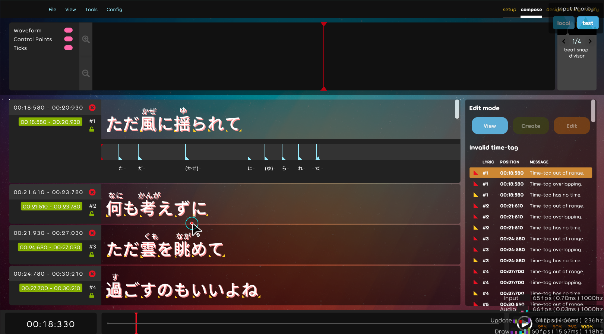

## Code quality

- Refactor exists lyric editor. [karaoke](#660@andy840119)
- Adjust namespace in singer editor. [karaoke](#661@andy840119)
- Random fix. [karaoke](#665@andy840119)
- Refactor saiten visualization. [karaoke](#695@andy840119)
- Use an easy way to create child dependency with texture resources. [karaoke](#698@EVAST9919)
- Adjust edit mode order. [karaoke](#701@andy840119)

## Editor

- Fix cannot fully delete lyrics in the lyric editor. [karaoke](#659@andy840119)
- Implement each edit mode will have its own color theme in the lyric editor. [karaoke](#669@andy840119)
- Random fixes lyric editor. [karaoke](#672@andy840119)
- Fix causes crash in time-tag edit mode if all time-tag with no-time in the lyric. [karaoke](#674#675@andy840119)
- Fix time tag preview text in the lyric editor. [karaoke](#677@andy840119)
- Adjust some behavior in time-tag mode. [karaoke](#681@andy840119)
- Implement switch edit mode at the right side of the lyric editor as extend. [karaoke](#680@andy840119)
  
- Let edit mode in the time-tag extend area has more info in the lyric editor. [karaoke](#682#683@andy840119)
- Apply tabbed to switch input in translate and lyric editor. [karaoke](#685@andy840119)
- Fix some behavior in recording time-tag mode. [karaoke](#689@andy840119)
- Add time-tag check that each lyric should have at least one end time-tag. [karaoke](#690@andy840119)
- Improve singer editor. [karaoke](#692@andy840119)
- check should have a start time tag in the lyric. [karaoke](#700@andy840119)

## Fix

- Fix ILRepack might cause image missing. [karaoke](#657@andy840119)
- Fix slow loading speed in the changelog, also apply new style. [karaoke](#666#667@andy840119)
