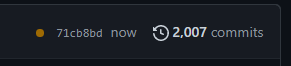
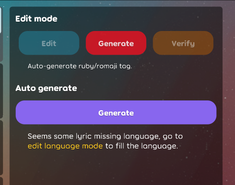
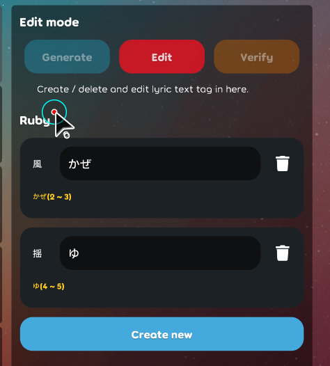

## Achievement

- \69 Stars/  
  
- more than 2000 commits, means need to make 27 commits to earn a star /\_\  
  

## Beatmap

- Check text tag should not empty. [karaoke](#714@andy840119)
- Improve `CheckInvalidTranslateLyrics` to check invalid translate. [karaoke](#748@andy840119)

## Code quality

- Use the real color picker to replace the fake one. [karaoke](#705@andy840119)
- Clean up code. [karaoke](#721@andy840119)
- Refactor lyric maker caret. [karaoke](#725#726@andy840119)
- Move `state` into individual class in the lyric editor, which means not place all value in the main class. [karaoke](#732#736#737@andy840119)
- Implement the base auto-generate section. [karaoke](#741@andy840119)

## Editor

- Implement note generator. [karaoke](#702@andy840119)
- Implement auto generate note section, for selecting target lyric to apply. [karaoke](#703@andy840119)
- Able to select lyric for apply in lyric editor. [karaoke](#448#706#708@andy840119)
- Implement language generator. [karaoke](#707@andy840119)
- Apply selection in note auto generate. [karaoke](#711@andy840119)
- Separate `ruby`/`romaji` into two area. [karaoke](#712#713#715@andy840119)
- Enable to auto-generate time-tag for individual lyric. [karaoke](#403@andy840119)
- Implement `time tag` auto generate section. [karaoke](#717@andy840119)
- Adjust badge in some mode. [karaoke](#718@andy840119)
- Implement ruby / romaji issue table. [karaoke](#719@andy840119)
- Implement create / remove language in generator config. [karaoke](#722@andy840119)  
  
- Deal with the cause if old value is equal to new value in `BindArrayChanged`. [karaoke](#724@andy840119)
- Implement section to sync note `scrolling range`. [karaoke](#728@andy840119)
- Should not able to generate `ruby`/`romaji` if not select `language`. [karaoke](#716@andy840119)
- Should disable detect language if has no text in lyric. [karaoke](#738@andy840119)
- Split `section` in `language` and `ruby`/`romaji` mode. [karaoke](#739#740@andy840119)
- Should show invalid text hint next of generate area. [karaoke](#742@andy840119)  
  
- Adjust button order and color in edit `ruby`/`romaji` mode. [karaoke](#745@andy840119)  
  

## Import

- Should be able `roll-back step` if click the invalid text in the lyric editor in the import screen. [karaoke](#746@andy840119)
