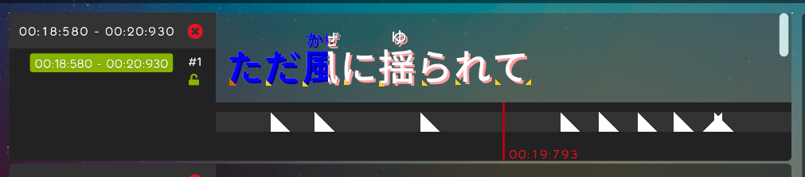

## Achievement

- \more than 69 stars/
- No. 777 PR has been created.

## Code quality

- Regular clean-up code. [karaoke](#755#760#776@andy840119)
- Refactor `IPositionCalculator`, for better way to detect column size changed. [karaoke](#585#758@andy840119)
- Rewrite `note selection blueprint` to use only `HitObject` (no `DrawableHitObject`) for layout. [karaoke](#696#771@andy840119)
- Refactor skin font. [karaoke](#780@andy840119)
- Use `RNG` in utils to replace `System.Random`. [karaoke](#784@andy840119)

## Editor

- Implement base extra recording mode area in `lyric editor`. [karaoke](#751#752#753@andy840119)  
  
- Add `config button` next to the auto-generate button. [karaoke](#764@andy840119)
- should make `lyric editor` has its own `config manager`. [karaoke](#765#766@andy840119)
- Add more config in `lyric editor`. [karaoke](#767#768@andy840119)
- Should sync selection in `singer container`. [karaoke](#691#774#775@andy840119)
- Should change notes if user re-generates note. [karaoke](#704#786@andy840119)

## Fix

- because `font resource` has changed in `osu-resource`, so update font list is needed. [karaoke](#777@andy840119)
- Should have preview font style in the font selector. [karaoke](#778#779@andy840119)
- Fix cannot go to the result screen. [karaoke](#782#785@andy840119)

## Setting

- Should clear `hover area` in `config page` if typing in config section. [karaoke](#761#763@andy840119)
- Should show something if use not select any section in `config page`. [karaoke](#762#763@andy840119)
- Should have preview font style in config. [karaoke](#783@andy840119)  
  
