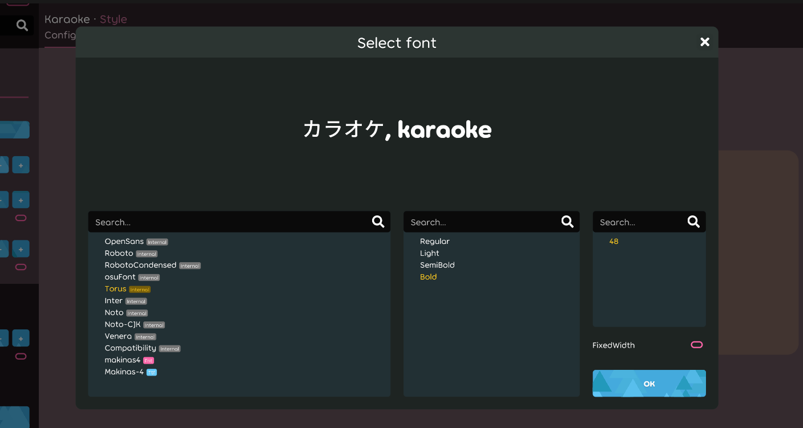

## Achievement

- Now this ruleset can read `.ttf` fonts without any conversion.
  

## Code quality

- Refactor `font manager` and implement bitmap font generator. [karaoke](#788@andy840119)
- Regular clean-up code. [karaoke](#799@andy840119)
- Use new switch expression. [karaoke](#800@andy840119)
- Update nuget package and clean-up code. [karaoke](#801@andy840119)

## Editor

- Improve karaoke ruleset's own `colour selector`. [karaoke](#793@andy840119)

## Fix

- Fix the change log style broken issue. [karaoke](#803@andy840119)
- Fix `TTF font` cannot use in release build. [karaoke](#809#810#812@andy840119)
- Fix karaoke key layout does not have the name. [karaoke](#808#811@andy840119)
- Update NuGet and re-write difficulty calculator. [karaoke](#813@andy840119)
- Fix cannot enter config page (should work until next release due to API changed). [karaoke](#814#816#817@andy840119)

## Skinning

- Implement `TTFGlyphStore`, for accepting `.ttf` fonts. [karaoke](#527#791#794@andy840119)
- Fix `ttf glyph store` and refactor font manager. [karaoke](#794#796@andy840119)
- Make `ttf glyph store` can work in gameplay, which need framework fix also. [karaoke](#805@andy840119)
- Add font type property in `FontInfo`. [karaoke](#806@andy840119)
- Show font format in `font selector`. [karaoke](#807@andy840119)
- Implement create `font folder` and `hot-reload` font list. [karaoke](#818@andy840119)
