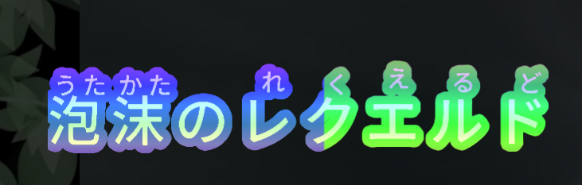

## Achievement

- Karaoke text having outline effects now, big thanks to [@Evast](https://github.com/EVAST9919)
- Live alone now so 尻尻放題
- More than 87 stars, 87 is a lucky number in our country.

## Framework

- Implement lyric text shader effect. [font-package](#41@andy840119)
- Apply shader effect in karaoke sprite text. [font-package](#43@andy840119)
- Remove some properties. All style property should be implemented by shader. [font-package](#44#49@andy840119)
- Implement step shader for letting user able to decide target render buffer. [font-package](#45#48@andy840119)
- Implement rainbow shader effect. [font-package](#47@andy840119)
- Fix shader render performance issue. Should not create new frame buffer in every frame. [font-package](#51@andy840119)
- Fix the case that text is disappear in some case. [font-package](#53@andy840119)
- Fix time-tag time calculation. [font-package](#54@andy840119)
- Implement masking container for able to masking target direction. [font-package](#59@andy840119)
- Fix shader edge might be cut. [font-package](#60@andy840119)

## Fix

- Add missing link in changelog preview. [karaoke](#848#849@andy840119)
- Fix the case that text will disappear if drag ruby position. [karaoke](#850#851@andy840119)

## Setting

- Able to adjust ruby romaji margin in the config page. [karaoke](#852@andy840119)
