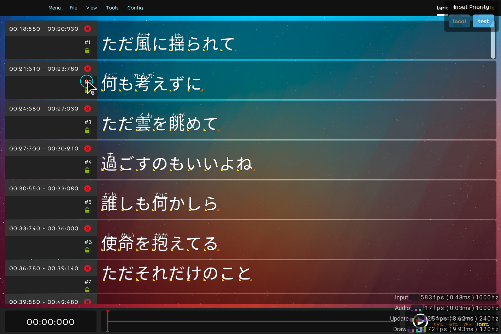

## Achievement
- Refactor some editor.
- Not karaoke editor has its own
- Implement change handler for lyric objects.

## Code quality
- Rename from "ImportLyricScreen" into "LyricImporter". [karaoke](#934#936@andy840119)
- Clean up code. [karaoke](#946@andy840119)
- Remove postfix "Screen" in "KaraokeConfigScreen" class. [karaoke](#941#947@andy840119)
- Clean up code by hand. [karaoke](#948@andy840119)
- Update var usage inspections to disallow for built-in types. [karaoke](#966#967@andy840119)
- Fix "Parameter type can be IEnumerable of T" issue. [karaoke](#968#969@andy840119)

## Editor
- Make editor sub-screen inherit real screen. [karaoke](#933@andy840119)
- Make lyric import into editor screen. [karaoke](#932@andy840119)
- Move lyric editor into individual screen. [karaoke](#931@andy840119)
- Implement karaoke editor screen. [karaoke](#935@andy840119)
- Fix missing dependencies not found issue in karaoke editor. [karaoke](#939@andy840119)
- Implement karaoke skin editor. [karaoke](#942@andy840119)
- Remove `EditorSubScreen` because seems over-design. [karaoke](#940@andy840119)
- Remove editor sub screen class. [karaoke](#944@andy840119)
- Remove un-need menu item. [karaoke](#945@andy840119)
- Implement all handler for property change in the editor. [karaoke](#954#962@andy840119)
- Using change handler to replace some `manager`. [karaoke](#957#964@andy840119)

## Utility
- Implement bindables utils to sync data with two different type of bindable list. [karaoke](#956@andy840119)