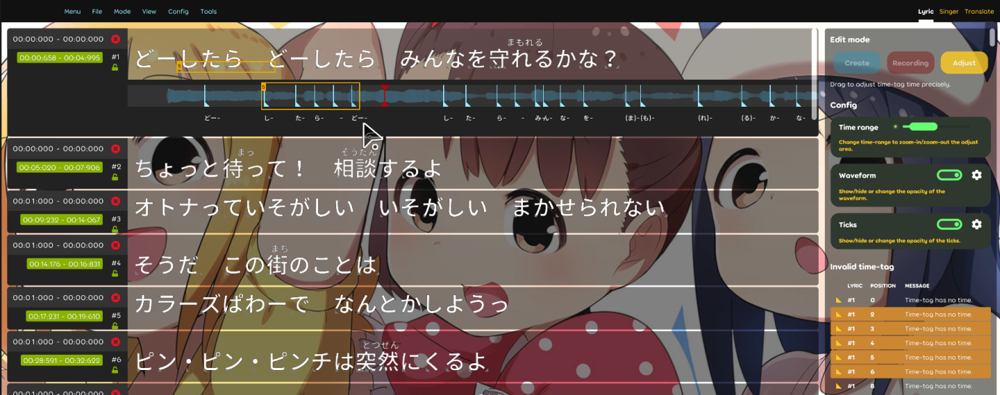
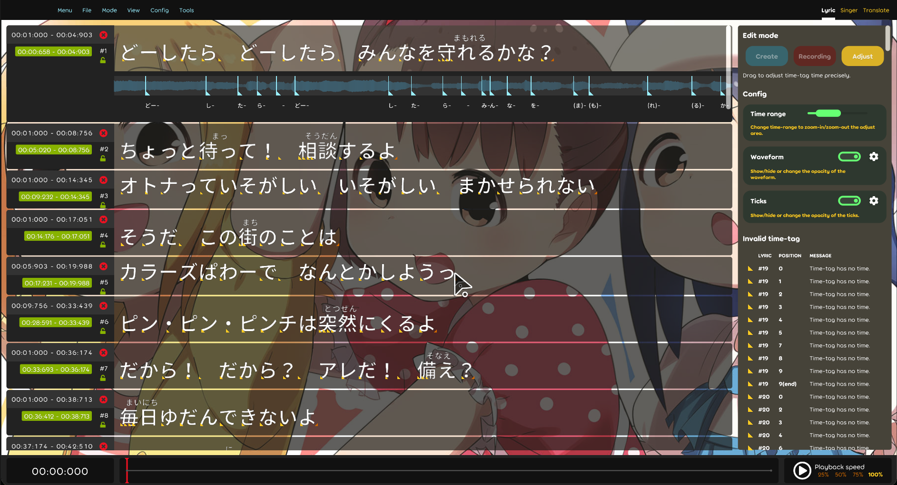
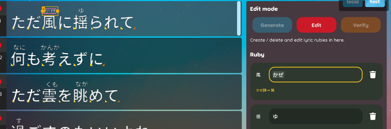

## Achievement

- Find a new `fucking` IL packing tool to replace the broken one.  
  
- Able to export `karaoke Json beatmap` for testing purposes.
- Start working on making the `karaoke beatmap` more useful(Beatmap is just for personal testing purposes).  
  

## Beatmap

- Should re-sort the order while saving the `time-tags` to the `JSON`. [karaoke](#1119#1127@andy840119)
- Implement karaoke beatmap JSON loader. [karaoke](#1107#1132@andy840119)

## Code quality

- Clean up code. [karaoke](#1150@andy840119)
- Write the test case for caret state. [karaoke](#1175#1177@andy840119)
- Adjust test case usage. [karaoke](#1178@andy840119)

## Editor

- Create mode-specific states for the lyric editor. [karaoke](#1114@andy840119)
- Fix might cause exceptions if throw null `ruby`/`romaji` list into the lyric. [karaoke](#1116@andy840119)
- Add test cases for `lyric`/`note` related change handler. [karaoke](#1121@andy840119)
- Make sure only select one lyric in some cases in the change handler. [karaoke](#1118#1123@andy840119)
- Implement tick effect in the lyric editor. [karaoke](#1126@andy840119)
- Write its class to replace or inherit `ZoomableScrollContainer` in the Lazer project. [karaoke](#1136#1138@andy840119)
- Should be able to record the zoom scale in the `record`/`adjust` mode. [karaoke](#1139@andy840119)
- Should be able to `show`/`hide` the waveform graph in the `record`/`adjust` mode. [karaoke](#1140@andy840119)
- Fix cannot press the escape key to exit the karaoke editor screen. [karaoke](#1134#1141@andy840119)
- Should show the `key value` in some description in the lyric editor. [karaoke](#1142@andy840119)
- Able to change the `key binding` by pressing the key in the description. [karaoke](#1144#1145@andy840119)  
  
- Able to delete the note in the lyric editor. [karaoke](#1148#1153@andy840119)
- Use the better way to get the `editor menu bar` for able to insert some extra selection. [karaoke](#1155@andy840119)
- Should change editor clock time if change caret position in the `recording mode`. [karaoke](#1133#1156@andy840119)
- Fix submit lyric property value failed in some cases. [karaoke](#1157@andy840119)
- Adjust the color theme in the lyric editor. [karaoke](#1163@andy840119)  
  
- Should be able to export `karaoke testing JSON beatmap` in the main editor. [karaoke](#1158#1164@andy840119)
- Fix the `recording caret algorithm` for more user-friendly. [karaoke](#1165@andy840119)
- Should have a better way to get event before the caret position changed. [karaoke](#1174@andy840119)

## Tooling

- Fix `.dll` packing issue. [karaoke](#1131@andy840119)

## UX

- Should be better to `auto-focus` on the first `ruby`/`romaji` tag if changed to the different lyric. [karaoke](#1171#1173@andy840119)  
  
