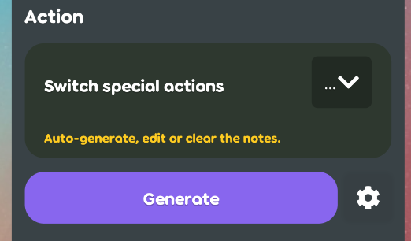
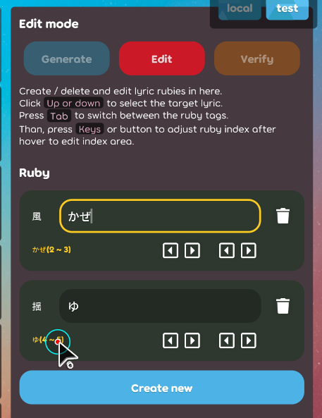
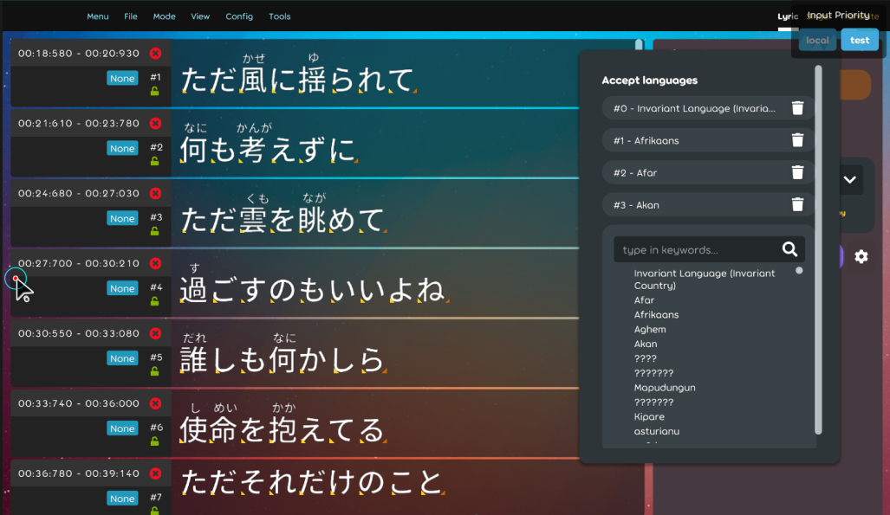
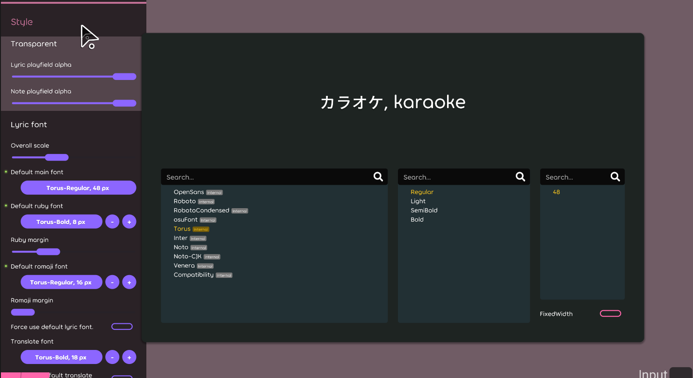

## Achievement
- Got the star more fester recently in the [repo](https://github.com/karaoke-dev/karaoke). Nice star earner.
- Not being fired.
- Random fix the UX error in the karaoke editor.
- No `1234` pull-reuqest has been  created. [karaoke](#1234@andy840119)

## Beatmap
- Make the properties in the `Singer.cs` into bindable. [karaoke](#1222#1223@andy840119)

## Code quality
- Move some enums into the better place. [karaoke](#1215@andy840119)
- Refactor time tag and caret display area. [karaoke](#1216@andy840119)
- Move some mode specific action into the section. [karaoke](#1219@andy840119)
- Move `LanguageSelector` out of the `LanguageSelectionDialog`. [karaoke](#1228@andy840119)
- Write utils for `culture info`. [karaoke](#1231@andy840119)

## Editor
- Make auto-generate button into the individual section. [karaoke](#1180#1181@andy840119)
- Move some feature into special action section. [karaoke](#1182@andy840119)    
  
- Implement select to batch change the language. [karaoke](#1170#1183@andy840119)
- Able to batch delete the lyric. [karaoke](#1184@andy840119)
- Should cancel the selection after change to the new action. [karaoke](#1185@andy840119)
- Use keyboard to change the `start`/`end` index in the `ruby`/`romaji` tag. [karaoke](#1172#1189@andy840119)    
  
- Refactor the inherit of `TextTagEditSection` [karaoke](#1188#1190@andy840119)
- Use `EditorRoundedScreen` in the `singer` and `translate` screen. [karaoke](#1191#1192@andy840119)
- Implement switch `create time tag` caret algorithm in the `edit time-tag` mode. [karaoke](#1218@andy840119)
- Implement `hue selector` for singer editor. [karaoke](#1224@andy840119)
- Use popover instrad of dialog to edit singer info. [karaoke](#1225#1221@andy840119)
- Re-design the language list config area for `auto-assign language` algorithm. [karaoke](#1234@andy840119)    
  

## Fix
- Invest the change of `BlueprintContainer` in lazer after upgrade the package. [karaoke](#1176@andy840119)
- Should not show the selection in the add lyric area. [karaoke](#1193#1197@andy840119)
- Fix cause the crash after tab in the edit note text area. [karaoke](#1196#1198@andy840119)
- Should not change the caret position in the lyric editor mode. [karaoke](#1194#1199@andy840119)
- Fix error while searching in the config page. [karaoke](#1203@andy840119)
- Should update toolbar mode selection after switch the mode by extend area. [karaoke](#1135#1205@andy840119)
- Fix language dialog not able to select the language right now. [karaoke](#1214@andy840119)

## Gameplay
- Adjust toast text in the gameplay. [karaoke](#1201@andy840119)
- Able to adjust the karaoke setting button alpha. [karaoke](#1209#1210@andy840119)

## UX
- Make font selection dialog into popover. [karaoke](#1226#1227@andy840119)    
  
- Replace language selection `dialog` into `popover` in some of the pages. [karaoke](#1229@andy840119) 