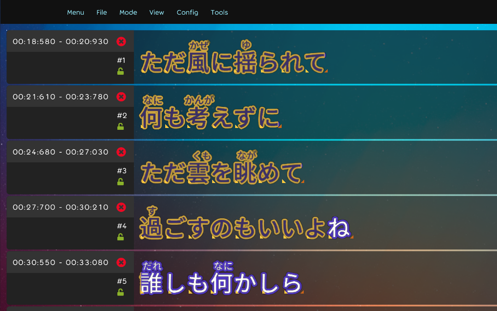

## Achievement

- Fix some karaoke text effect and let it runnable in the osx.
- Damn lots of work in the font framework.
- Adjust the style in the lyric editor.
  

## Code quality

- Running clean up code script. [karaoke](#1273@andy840119)
- Refactor preview lyric component. [karaoke](#1281@andy840119)
- Refactor collect singing lyrics logic. [karaoke](#1282@andy840119)
- Do not pass beatmap in practice overlay. [karaoke](#1283@andy840119)
- Refactor the gameplay setting overlay. [karaoke](#1285#1286@andy840119)
- Refactor the usage of DefaultLyricPiece. [karaoke](#1288#1289@andy840119)
- Remove un-need caret algorithm. [karaoke](#1217#1301@andy840119)
- Should not get bindable change event directly hit object. [karaoke](#1302@andy840119)
- Remove and refactor some un-need methods in the TimeTagsUtils. [karaoke](#1303@andy840119)

## Editor

- Add outline effect in the lyric editor. [karaoke](#1275@andy840119)

## Framework

- Let the shader to support older version. [font-package](#140@andy840119)
- Add missing toSRGB() to some shaders for fixing the color issue. [font-package](#145@andy840119)
- Fix CRT shader cannot run on the osx. [font-package](#147@andy840119)
- Fix karaoke sprite text playback issue. [font-package](#150@andy840119)
- Fix lyric sprite text alpha issue. [font-package](#152@andy840119)
- Increase shader outline performance. [font-package](#155@andy840119)
- Refactor some test case. [font-package](#160@andy840119)
- Add test case for reverse time-tags. [font-package](#162@andy840119)
- Write test case for show transformers issue. [font-package](#165@andy840119)
- Fix left-side shader showing before first time-tag time. [font-package](#166@andy840119)
- Implement `SingleShaderBufferedDrawNode` to make sure that some GC issue not happened. [font-package](#169@andy840119)
- Implement real-time calculate `ComputeScreenSpaceDrawQuad` in `KaraokeSpriteText`. [font-package](#171@andy840119)
- Make characters private in the lyric sprite text. [font-package](#172@andy840119)
- Refactor draw node and shader. [font-package](#174@andy840119)
- Implement shader scale interface. [font-package](#175@andy840119)
- Fix sizing calculation issue in the shader. [font-package](#176@andy840119)
- Fix left-side shader showing before first time-tag time. [font-package](#177@andy840119)
- Should re-calculate the transforms if change the shader in the karaoke sprite text. [font-package](#179@andy840119)
- Change the time-tag param type in the karaoke sprite text. [font-package](#181@andy840119)
- Should add center time-tag inside every input time-tag in the input list. [font-package](#182@andy840119)
- Add property to decide interpolate time tags or not. [font-package](#185@andy840119)
- Able to filter the duplicated time tags. [font-package](#185@andy840119)
- Clean up code. [font-package](#188@andy840119)

## Fix

- Fix shader effect cannot work in the osx. [karaoke](#1274@andy840119)
- Adjust localization. [karaoke](#1276@andy840119)
- Fix config style messy issue after upgrade `osu.Game`. [karaoke](#1278@andy840119)
- Fix lyric playback issue. [karaoke](#1284@andy840119)
- Fix the dialog overlay usage. [karaoke](#1280@andy840119)
- Update font package to fix the render issue. [karaoke](#1292@andy840119)
- Fix the style in the change log. [karaoke](#1299#1300@andy840119)

## Performance

- Update the package to the latest to improve around 1.5x of the performance. [karaoke](#1290@andy840119)
