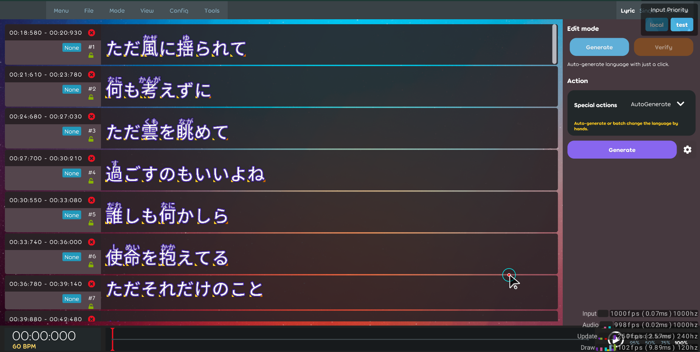

## Achievement

- 777 Pull-request merged.  
  
- Re-write a package for encode/decode the `.lrc` file, see [the project](https://github.com/karaoke-dev/LrcParser)]
- Lots of damn things done in this changelog, include writing this changelog.

## Beatmap

- Should handle the `time-tag` in the `lrc ruby tag`. [karaoke](#1338#1343@andy840119)

## Code quality

- Should use `UnbindBindings` instead of `UnbindAll` in some place. [karaoke](#1039#1305@andy840119)
- Rename the `EditorLyricPiece`. [karaoke](#1306@andy840119)
- Regular clean-up code. [karaoke](#1307@andy840119)
- Remove something like `state == TextIndex.IndexState.Start ? A : B`. [karaoke](#1311#1316@andy840119)
- Sync the project configuration following the lazer project. [karaoke](#1330@andy840119)
- Refactor Japanese `time tag generator` logic. [karaoke](#1344@andy840119)
- Define the common interface for the lyric property generator. [karaoke](#1355@andy840119)
- Refactor the test case for the `generator`. [karaoke](#1360@andy840119)

## Editor

- [outdated] Change edit singer info into pop-over. [karaoke](#897@andy840119)
- Clearify the selection state strategy in the lyric editor. [karaoke](#1327@andy840119)
- [outdated] Define time-tag behavior. Closed due to time-tag in the karaoke editor should be always sorted in the changer handler. [karaoke](#1207@andy840119)
- Update `lyric editor` style to follow the `latest design`. [karaoke](#1346@andy840119)  
  
- Implement caret for select language mode. [karaoke](#1352@andy840119)
- Implement `auto-generator` change handler for lyric. [karaoke](#1356#1357@andy840119)

## Framework

- Upgrade the font package to fix the font resource related issue. [karaoke](#1323@andy840119)
- Upgrade lucene package to the latest for trying to fix the crash issue. [karaoke](#1325@andy840119)
- Using `LrcParser` package instead of the old one(`LyricMaker`) because new package's code quality is much better and easy to test. [karaoke](#1339@andy840119)
- Fix the lyric text not showing if contains no time-tag in the karaoke text. [karaoke](#1347@andy840119)
- Install the localization package for able to generate the localization string in the IDE. [karaoke](#1358@andy840119)

## Fix

- Fix right triangle sizing calculation. [karaoke](#1310@andy840119)
- Fix time-tag anchor in the lyric editor. [karaoke](#1308#1313#1314@andy840119)
- Fix crash in the adjust time-tag mode. [karaoke](#1309#1315@andy840119)
- Fix compile error after upgrade the `SixLabors`. [karaoke](#1322@andy840119)
- Fix `language detection` might be got the wrong result if select multiple lyrics at the same time. [karaoke](#1326#1328@andy840119)
- Fix the time-tag position. [karaoke](#1312#1329@andy840119)
- Fix `Children cannot be cleared on a disposed drawable.` exception in the import lyric screen. [karaoke](#1348#1350@andy840119)
- Fix `select language` might cause crash in the `selecting language step` in the `lyric importer`. [karaoke](#1349@andy840119)
- Fix got crash while generating the ruby. [karaoke](#1353#1354@andy840119)
- Should not able to select if there's no `auto-generator` for the `current language`. [karaoke](#1335#1359@andy840119)
- Fix preview note playfield crash in the config page. [karaoke](#1361@andy840119)

## Reliability

- Not call `bindable change` directly in the caret state. [karaoke](#1351@andy840119)

## Setting

- Should show the cursor as default. [karaoke](#1342#1345@andy840119)
