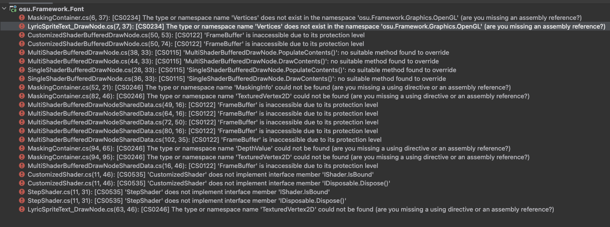
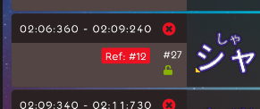
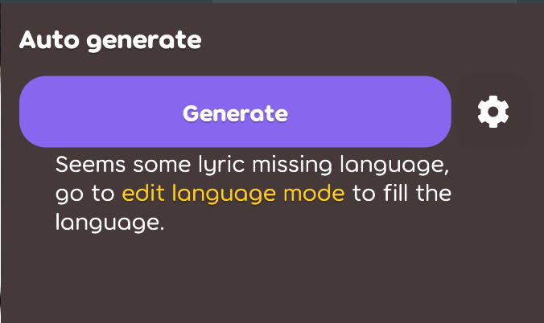

## Achievement
- Implement `copy`/`paste` feature in the lyric editor.
- Start implement `reference lyric` feature. The lyric property can be sync by other lyric if they are very similar.    

- Following the refactor in the o!f to fix the api change.    

- Pull-request [#1450](https://github.com/karaoke-dev/karaoke/pull/1450) has been created.    

- Refactor the format ahd behavior in the scoring note.

## Beatmap
- Implement lyric translate json convertor. [karaoke](#1492#1493@andy840119)
- Implement `IDeepCloneable<T>` for some hit object for better copy experience. [karaoke](#1482#1490@andy840119)
- Should not save the note's start/end time to the beatmap. [karaoke](#1496#1497@andy840119)
- Add reference time tag index for note onject. [karaoke](#1498@andy840119)
- Rename property name to the note object. [karaoke](#1499@andy840119)
- Implement auto-change the time by reference lyric. [karaoke](#1500@andy840119)

## Code quality
- Move the karoake hit object json serializer config into individual class. [karaoke](#1448@andy840119)
- Collect the common change handle method into singer interface. [karaoke](#1448@andy840119)
- Adjust the `RemoveAll` method stype in the interface `ILyricListPropertyChangeHandler`. [karaoke](#1453#1462@andy840119)
- Reduce duplicated override in the `EditModeSection`. [karaoke](#1469#1476@andy840119)
- Refactor the override to let the class `EditModeSection` more simple. [karaoke](#1477#1481@andy840119)
- `Languages` namespace should remove that stupid `s` bacause one lyric only can detect one language. [karaoke](#1468#1484@andy840119)
- Refactor the Note or Notes utils. [karaoke](#1501#1502@andy840119)

## Editor
- Implement copy and paste lyrics properties in the lyric editor. [karaoke](#1449@andy840119)
- Implement remove time-tags features for the selection handler. [karaoke](#1451@andy840119)
- Apply the common interface into the singer change handler for able to add or remove range of singers. [karaoke](#1452@andy840119)
- Implement add lyric to lyric change handler for able to paste the lyric. [karaoke](#1454@andy840119)
- Implement copy the lyric or lyric property in the lyric editor clipboard. [karaoke](#1446#1455@andy840119)
- Show the toast after copy, cut or paste the lyric. [karaoke](#1457#1458@andy840119)
- Add reference lyric change handler for able to add the referenced lyric into lyric(?). [karaoke](#1465@andy840119)
- Implement reference lyric detector for able to dectect the reference lyric if the lyric text are the same. [karaoke](#1466@andy840119)
- Combine manage and typing mode because they are similar. [karaoke](#1471@andy840119)
- Implement an individual edit mode for let user to select the reference lyric. [karaoke](#1470#1473@andy840119)
- Implement reference lyric section and auto-generate feature. [karaoke](#1474@andy840119)
- Rename from manage lyric into split lyric in the texting mode. [karaoke](#1472#1478@andy840119)
- Implement reference lyric badge. [karaoke](#1480@andy840119)    

- Adjust the non-match hint string in the reference lyric auto-generate section. [karaoke](#1487#1494@andy840119)    

## Framework
- Fix the breaking change in the current `o!f` release. [font-package](#245@andy840119)
- Let the karoake font and lyric sprite text support multiple shoader. [font-package](#247@andy840119)

## Fix
- Prevent reload the section while switch the typing/split mode. [karaoke](#1485@andy840119)

## UI/UX
- Should auto-fucus to the textbox in the language selector popover. [karaoke](#1461#1463@andy840119)