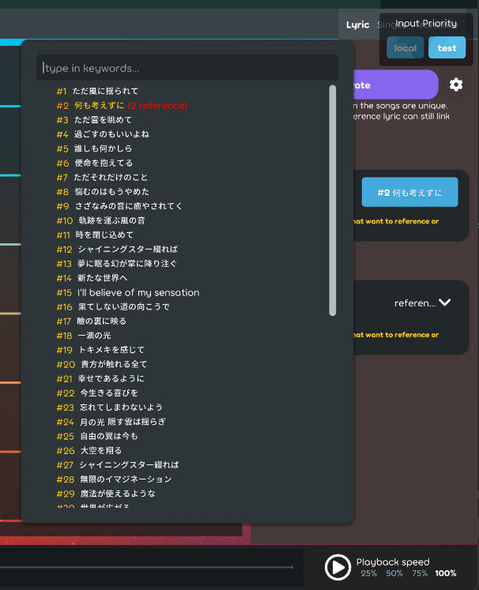
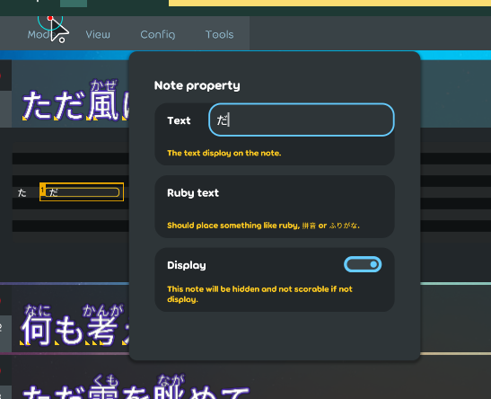

## Achievement

- Implement the sync logic in the lyric and the lyric editor.
- Better weather now.

## Beatmap

- Add the `LyricPropertyWritableVersion` property in the lyric for letting editor to check the latest writable version. [karaoke](#1557#1559@andy840119)
- Implement lyric can reference by other lyric. [karaoke](#1444@andy840119)

## Code quality

- Improve the `HitObjectWritableUtils`. [karaoke](#1555@andy840119)
- Refactor the lock utils and remove the utils in the lyric editor. [karaoke](#1565@andy840119)
- Refactor the create text tag button in the lyric editor. [karaoke](#1569@andy840119)
- Refactor the logic in the labelled edit component. [karaoke](#1570@andy840119)
- Refactor lyric editor row namespace for easier to be maintained. [karaoke](#1572@andy840119)
- Refactor the editor and the layer in the lyric editor. [karaoke](#1575@andy840119)
- Should be able to get the move type in caret. [karaoke](#1579@andy840119)
- Adjust the structure in the change handler. [karaoke](#1587@andy840119)

## Editor

- Implement utils to check is lyric editable by modes. [karaoke](#1554#1558@andy840119)
- Show the reference lyric amont in the reference lyric selection. [karaoke](#1560@andy840119)  
  
- Implement popover to select the lyric. [karaoke](#1445@andy840119)
- Disable click the select reference button if being referenced. [karaoke](#1561@andy840119)
- Should check if lyric property is locked in the change handler. [karaoke](#1562@andy840119)
- Should block edit in the lyric property section if property is not editable. [karaoke](#1536#1566@andy840119)  
  
- Expose the writable interface in the change handler. [karaoke](#1550@andy840119)
- Should not let user use tricky way to edit the blocked area in the lyric editor section. [karaoke](#1568@andy840119)
- Should let the lyric looks disabled if lyric property is not editable. [karaoke](#1573@andy840119)  
  
- Should not let user able to modify the property by clicking the lyric editor row lf property is not editableo in the lyric. [karaoke](#1540@andy840119)
- Should clear the SelectedItems in the states if lyric is not allow to edit. [karaoke](#1567@andy840119)
- Implement the lock change handler for able to lock the lyric. [karaoke](#961@andy840119)
- Implement the state for each rows. [karaoke](#1582@andy840119)
- Implement trigger disable edit effect method and event for able to show alert if user trying to edit the locked lyric. [karaoke](#1584@andy840119)
- Add utils to check if lyric is able to be removed. [karaoke](#1586@andy840119)
- Add more check if add or remove the hit-object in the change handler. [karaoke](#1588@andy840119)
- Implement disallow edit effect in the edit lyric row. [karaoke](#1590#1592@andy840119)

## Fix

- Fix cannot navigate to those disabled rows by keyboard. [karaoke](#1576@andy840119)
- Fix the time tag edit mode naming issue. [karaoke](#1564#1577@andy840119)  
  
- Fix the weird behavior if click the row with blueprint. [karaoke](#1578#1581@andy840119)
- Fix the wrong check logic in the writable utils and change handler. [karaoke](#1589@andy840119)

## UI/UX

- Improvement the edit note experience. [karaoke](#1580@andy840119)  
  
- Adjust the behavior in the lyric editor. Should be able to focus to those locked lyric even it's not able to edit. [karaoke](#1583@andy840119)
