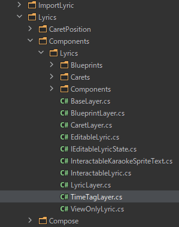
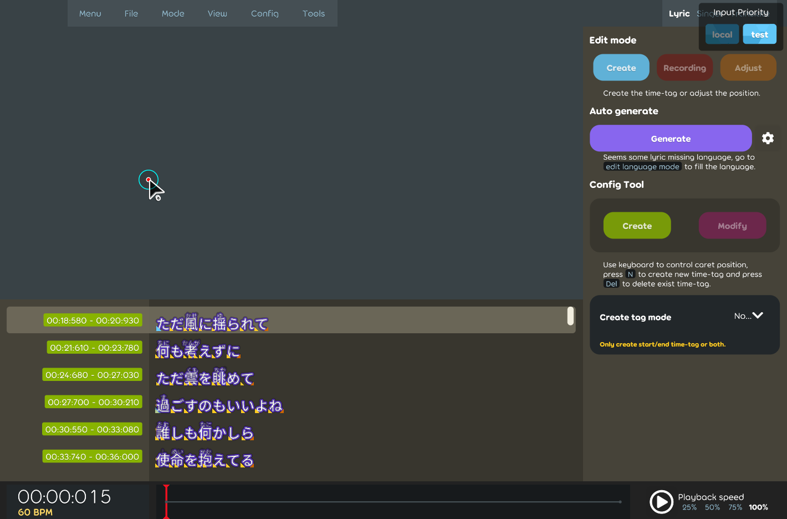
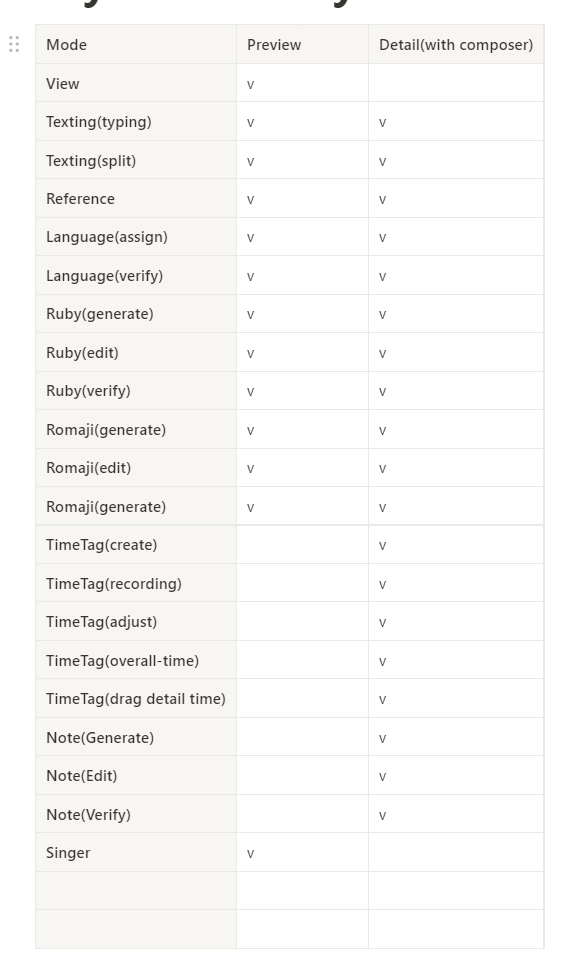
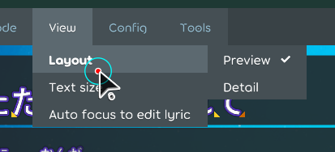
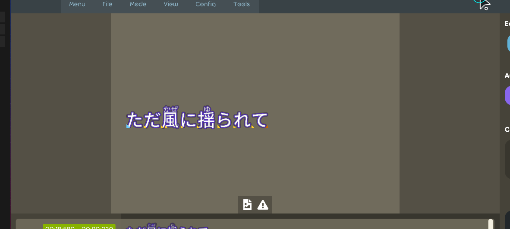
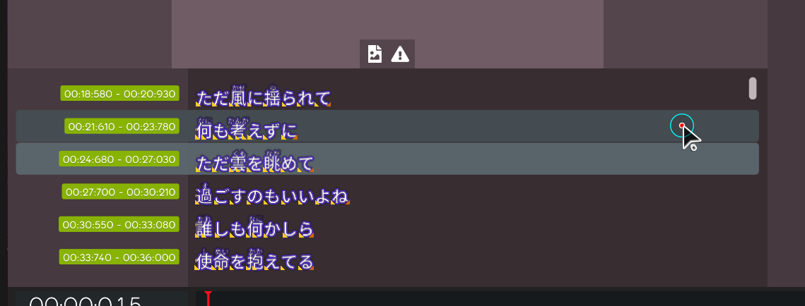

## Achievement

- Start implementing another layout for lyric editor(design is modified from [flyet's work](https://www.figma.com/file/ytnnne2TH8Z956Jxhiypqq/Beatmap-Editor-2?node-id=0%3A1)). [karaoke](#1594#1628@andy840119)  
  

## Code quality

- Adjust the inherit class in the lyric editor extend area. [karaoke](#1597@andy840119)
- Rename from "extend" into "settings" in the lyric editor. [karaoke](#1596#1598@andy840119)
- Move some lyric list related logic into the "rows" namespace. [karaoke](#1599@andy840119)
- Adjust some class namespace in the lyric editor. [karaoke](#1601@andy840119)
- Adjust namespace in the lyric list. [karaoke](#1602@andy840119)
- Move the background adjust related logic into `row` namespace. [karaoke](#1604@andy840119)
- Extea adjust for implement another layout for lyric editor. [karaoke](#1605@andy840119)
- Rename some components in lyric editor composer. [karaoke](#1624@andy840119)
- Move abstract component in the root namespace. [karaoke](#1626@andy840119)
- Move single lyric editor into shared namespace because it will be used in both lyrics row and composer. [karaoke](#1627@andy840119)  
  
- Separate editable and view-only into two different lyric. [karaoke](#1631@andy840119)

## Editor

- Implement detail lyric list view. [karaoke](#1607@andy840119)  
  
- Define the support layout list. [karaoke](#1611@andy840119)  
  
- Add layout preference config for lyric editor. [karaoke](#1615@andy840119)  
  
- Implement the compose area in the lyric editor. [karaoke](#1616@andy840119)  
  
- Remove the extend area in the lyric editor row because it will be mored into the composer. [karaoke](#1617#1623@andy840119)
- Implement the bottom editor for composer. [karaoke](#1625@andy840119)  
  

## Fix

- Fix wrong row background color type in the lyric editor. [karaoke](#1606@andy840119)
- Fix bindable change does not triggered from the menu item. [karaoke](#1613@andy840119)
- Fix the background color not changed by edit mode in the lyric editor. [karaoke](#1629#1630@andy840119)  
  

## Performance

- Should be able to get the focus lyric in the lyric caret state for prevent duplicated triggered. [karaoke](#1618#1619@andy840119)
- Implement check lyric change utils. [karaoke](#1620@andy840119)
