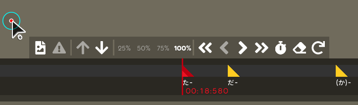
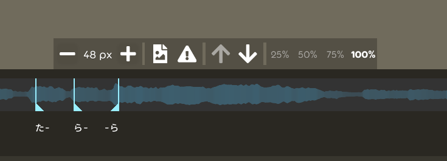

## Achievement

- \1000 pull-request/  
  
- Make the toolbar button more complete in the lyric editor.
- Got that damn real COVID-19
- Not really sure, IDK.
- Adjust the github release flow.
- Refactor the checks in the editor.

## Code quality

- Refactor the edit input manager. [karaoke](#1637@andy840119)
- Refactor the caret position algorithm. [karaoke](#1640#1642@andy840119)
- Should not expose the algorithm in the caret state. [karaoke](#1643@andy840119)
- Adjust the namespace in the toolbar namesapce. [karaoke](#1647@andy840119)
- Refactor the drawable caret and drawable part layer. [karaoke](#1650@andy840119)
- Change caret position format from class to structure for easier to be compared. [karaoke](#1653@andy840119)
- Refactor caret algorithm (separate the interface and rename). [karaoke](#1654@andy840119)
- Refactor caret algorithm (adjust method order). [karaoke](#1655@andy840119)
- Refactor caret algorithm (make some property protected and add the caret validator). [karaoke](#1656@andy840119)
- Refactor caret algorithm (adjust base interface). [karaoke](#1658@andy840119)
- Regular clean-up code. [karaoke](#1667@andy840119)

## Editor

- Should be able to get the sub-mode changed. [karaoke](#1636@andy840119)
- Implement some action buttons for the lyric composer in the lyric editor. [karaoke](#1638@andy840119)
- Should disable the move up and down button if not movable. [karaoke](#1639#1644@andy840119)  
  
- Should trigger the click effect after click the toolbar button. [karaoke](#1645@andy840119)
- Panel button should not have click effect. [karaoke](#1648@andy840119)
- Implement move time tag toolbar button in the lyric editor. [karaoke](#1652@andy840119)
- Add method to move to first or last index in the lyric. [karaoke](#1659@andy840119)
- Adjust the move caret action name. Use the "Move to previous/next lyric" instead of "Move up/down" to make action pure. [karaoke](#1660@andy840119)
- Add more flexible for restrict change the different lyric by changing the index inside the lyric. [karaoke](#1651#1661@andy840119)
- Adjust karaoke edit action and add more actions in lyric editor composer. [karaoke](#1663@andy840119)
- Able to auto-adjust the different composer size by bottom editor in the lyric editor. [karaoke](#1664@andy840119)
- Add more buttton in the toolbar for able to set and clear the time-tag time. [karaoke](#1665@andy840119)  
  
- Implement playback control in the composer. [karaoke](#1666@andy840119)  
  
- Implement adjust font size toolbar button in the composer. [karaoke](#1668@andy840119)  
  
- Implement shifting time tag timing change handler. [karaoke](#1670@andy840119)
- Remove the scroll striction and make sure scroll to the correct time in the adjust time-tag mode. [karaoke](#1671@andy840119)
- Implement animation for switching different layout in lyric editor. [karaoke](#1622#1676@andy840119)
- Do more works about checking invalid properties in the hit-object or in the beatmap. [karaoke](#1679@andy840119)
  - Refactor the check test case. [karaoke](#1680@andy840119)
  - Rename and separate the lyric-related checks. [karaoke](#1681@andy840119)
  - Refactor the check for checking lyric's translation. [karaoke](#1682@andy840119)
  - Refactor the check for checking lyric's ruby/romaji tag. [karaoke](#1684@andy840119)
  - Make the better way for getting invalid text-tag or time-tag in the lyric. For able to focus invalid item in the lyric editor. [karaoke](#1687@andy840119)
  - Add the customized ruby/romaji issue class back. For able to focus invalid item in the lyric editor. [karaoke](#1688@andy840119)
  - Refactor the check for checking lyric's time-tag. [karaoke](#1689@andy840119)
  - Refactor the check for checking note's reference lyric. [karaoke](#1690@andy840119)
  - Implement check for checking lyric's reference lyric. [karaoke](#1691@andy840119)
  - Implement check for checking note's text and reference time-tag index. [karaoke](#1692@andy840119)
  - Add more check to make sure that item in the issue template should not be duplicated or missing. [karaoke](#1693@andy840119)
  - Implement the base check for those check is checking reference property like note's or lyric's reference lyric. [karaoke](#1694@andy840119)
  - Give issue tempale a better naming, type or invalid message. [karaoke](#1695@andy840119)

## Fix

- Fix karaoke text not showing if use the legacy skin. [karaoke](#1621#1633@andy840119)
- Fix cannot click to navigate the caret in the detail lyric list. [karaoke](#1635@andy840119)
- Fix got the error if switch from typing mode into split text mode in the lyric editor. [karaoke](#1649@andy840119)
- Fix the wrong caret position calculation. [karaoke](#1662@andy840119)
- Fix the wrong position calculation in scroll container after refactored. [karaoke](#1678@andy840119)

## Performance

- Let change handler able to handle the change case that trigger every frame. [karaoke](#1669@andy840119)

## Tooling

- Switch another github action tool for release the build. [karaoke](#1673@andy840119)
- Instead of packing all necessary dlls into the single one, should be better to have location to copy all dlls into a folder for easier to testing. [karaoke](#1674@andy840119)
- Copy more dlls into target folder to prevent dll not found issue while running in lazer. [karaoke](#1675@andy840119)
