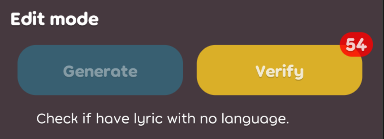
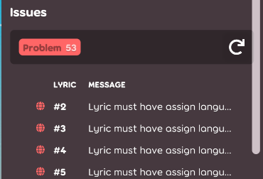
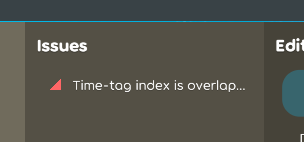
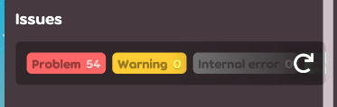

## Achievement
- Not lost my job.
- Not buying anything at 11/11.
- Not really sure... Maybe still alive(?)
- Bought an airpods charging case to make Apply happy.
- Make the editor happy.

## Code quality
- Edit mode state should be able to call the method to select the target item. [karaoke](#1708@andy840119)
- Remove duplicated check in the caret position algorithm test. [karaoke](#1714@andy840119)
- Remove the config class in the checks namespace. [karaoke](#1735@andy840119)
- Move the table into tooltip into better location. [karaoke](#1741@andy840119)
- Make caret position algorithm more complete. [karaoke](#1704@andy840119)

## Editor
- Check the generated caret type in the base class. [karaoke](#1697@andy840119)
- Refactor the caret position algorithm. [karaoke](#1698@andy840119)
- Implement ruby romaji caret position algorithm (but it's being removed after ;_;). [karaoke](#1700@andy840119)
  - Adjust behavior in the ruby romaji caret position algorithm. [karaoke](#1701@andy840119)
- Able to get the caret position directly from the caret state class. [karaoke](#1702@andy840119)
- Implement note caret position algorithm. (but it's being removed after ;_;). [karaoke](#1703@andy840119)
- Add method to move to target posiiton by lyric and lyric index. [karaoke](#1705@andy840119)
- Prevent create caret position instance out of the algorithm for safety issue. [karaoke](#1706@andy840119)
  - Because caret posiiton created from the algorithm should be always movable, so there's no need to expose the movable method. [karaoke](#1707@andy840119)
- Make the flow better between invalid table, caret and blueprint selection. [karaoke](#1696@andy840119)
- Remove the following caret position algorithm. [karaoke](#1709@andy840119)
  - Ruby caret position algorithm.
  - Romaji caret position algorithm.
  - Note caret position algorithm.
- Make ruby romaji as different edit mode. [karaoke](#1711@andy840119)
- Implement interface for able to switch to sub mode in the lyric editor. [karaoke](#1712@andy840119)
- Implement the issue navigator class for able to switch to the best edit mode to fix the target issue. [karaoke](#1710#1713@andy840119)
  - Should be able to navigate to the target time if possible. [karaoke](#1718@andy840119)
  - Fix some logic in the beatmap verifier. [karaoke](#1719@andy840119)
  - Remove old lyric checker. [karaoke](#1721@andy840119)
- Implement lyric editor check verifier. This class will auto-calcualte the issue if lyric or note edited in the lyric editor. [karaoke](#1717@andy840119)
- Refactor issue table. [karaoke](#1685#1720@andy840119)
- Implement the issue amount in the verify mode button. [karaoke](#1722#1724@andy840119)    
  
- Use the color in the issue instead of global color in the issue table. [karaoke](#1725@andy840119)
- Implement empty issue component. [karaoke](#1726@andy840119)    
  
- Implement check issue navigation. [karaoke](#1727@andy840119)    
  
- Implement the `issue class` for able to get the `lyric` or `note` from the issue easily. [karaoke](#1738#1739@andy840119)
- Implement issue icon. [karaoke](#1740@andy840119)
- Implement base issue table class for settings. [karaoke](#1742@andy840119)
- Implement invalid issue display in panel area. [karaoke](#1743@andy840119)    
      
  
- Fix issue table in the panel not update if press update button in the `settings` area. [karaoke](#1744#1745@andy840119)
- Add refresh button for single lyric issue table. [karaoke](#1746@andy840119)    
  

## Fix
- Fix delete all ruby text will cause exception. [karaoke](#1732#1736@andy840119)
- Fix `.dll` packing issue might cause crash while enter the editor. [karaoke](#1672@andy840119)

## UI/UX
- Adjust the issue navigator style. [karaoke](#1731#1737@andy840119)    
  Before:    
      
  After:    
      
- Learned from AegiSub. [karaoke](#1593@andy840119)