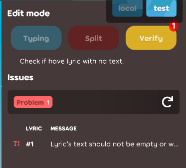
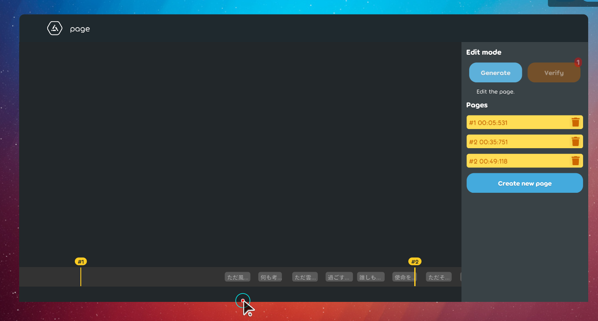
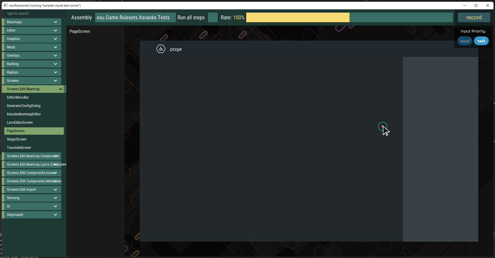
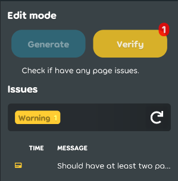
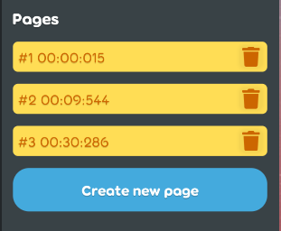
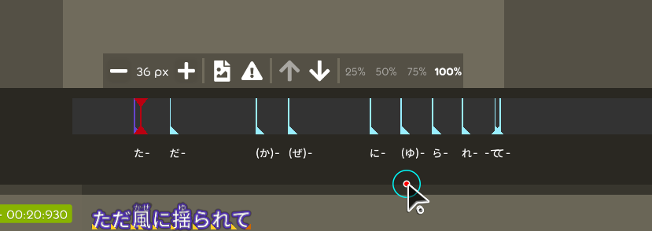

## Achievement

- Will go to american for a month i guess.
- Not buying anything at 12/12.
- Still have friends in this year.
- Still alive.
- Make everything happy except andy.

## Beatmap

- Remember the reference lyric id instead of instance in the json beatmap. [karaoke](#1757@andy840119)
  - Use beatmap processor to restore the lyric in the lyric or note. [karaoke](#1758@andy840119)
- Mark `start time` and `end time` as json-ignored in the lyric because this property is being calcualted. [karaoke](#1761@andy840119)
- Remove `InitialWorkingTime()` method in the lyric. Should use the better time to set-up the lyric start and end time. [karaoke](#1763@andy840119)
- Implement pages metadata in the beatmap. [karaoke](#1768@andy840119)
  - Should set the page index instead of page instance to the lyric. [karaoke](#1770@andy840119)
- Implement the singer convertor for able to save/load the singer or sub-singer into instance. [karaoke](#1771@andy840119)
  - Add more into to the sub-singer class. [karaoke](#1772@andy840119)
- Implement the singer info class for able to add/remove or get the singer. [karaoke](#1774@andy840119)
  - Apply the singer info into the karaoke beatmap. [karaoke](#1775@andy840119)
- Rename from `SubSinger` into `SingerState` for better understanding. [karaoke](#1776@andy840119)
- Implement beatmap page checks. [karaoke](#1780@andy840119)

## Code quality

- Run dotnet format to make the code happy. [karaoke](#1756@andy840119)
- Refactor the beatmap property-related change handler. [karaoke](#1773@andy840119)
- Move the `screen related things` (e.g. `lyric editor` or `singer editor`.) into screen namespace. [karaoke](#1767#1777@andy840119)
- Refactor lyric and note's class structure. Make the non-save property into individual class. [karaoke](#1801@andy840119)
- Move some editor-related component into more generic namespace. [karaoke](#1784@andy840119)
  - Make `EditModeSection<T>` and `LyricEditorSettings ` more generic because it will be used outside of the lyric editor. [karaoke](#1785@andy840119)  
    
  - Move the issue table into more generic location. [karaoke](#1787@andy840119)
  - Move issue section into more generic location. [karaoke](#1789#1792@andy840119)
  - Refactor some shared component and clean-up the code. [karaoke](#1790@andy840119)
  - Move the time-line part into more generic location. [karaoke](#1799@andy840119)
  - Make auto-generate section more generic. [karaoke](#1808@andy840119)
  - Refactor remaining part. [karaoke](#1788@andy840119)
  - Refactor some editor parts. [karaoke](#1810@andy840119)
- Refactor the generator.
  - Adjust generator namespace because the generator will not only generate lyric-related property after. [karaoke](#1804@andy840119)
  - Refactor the generate config method. [karaoke](#1807@andy840119)
  - Implement base class for generator and detector. [karaoke](#1809@andy840119)
- Use `Enum.GetValues<T>` instead of `EnumUtils.GetValues<T>()`. [karaoke](#1814@andy840119)
- Use new `ArgumentNullException.ThrowIfNull` throw-helper API in the `.net6`. [karaoke](#1817@andy840119)
- Use better way to get the all colour in the color provider in some color-related test cases. [karaoke](#1818@andy840119)

## Editor

- Add the issue table for the reference lyric edit mode. [karaoke](#1749@andy840119)  
  
- Fix change time tag time not update the lyric start and end time. [karaoke](#1762@andy840119)
- Implement beatmap page change handler. [karaoke](#1778@andy840119)
- Implement the page editor.
  
  - Implement base page editor. [karaoke](#1786@andy840119)  
    
  - Implement page editor verifier. [karaoke](#1793@andy840119)  
    
  - Implement pages section. [karaoke](#1797@andy840119)  
    
  - Implement page bottom timeline. [karaoke](#1800@andy840119)  
    
  - Improve the page editor. [karaoke](#1802@andy840119)
  - Implement page auto generator. [karaoke](#1806@andy840119)
  - Apply auto generator into editor. [karaoke](#1811@andy840119)
- [Close duplicated] Add loading animation if lyric haven't loaded. [karaoke](#938@andy840119)

## Fix

- Fix weird dragging experience in the adjust time-tag mode. [karaoke](#1752#1753@andy840119)  
  

## Skinning

- Rename from `lyric config` into `lyric font info`. [karaoke](#1760@andy840119)

## Tooling

- Upgrade the ruleset to the `.net6` to support latest lazer. [karaoke](#1813@andy840119)
  - Fix the release build not working. [karaoke](#1815#1816@andy840119)

## Utility

- Add utils to load save culture info. [karaoke](#1812@andy840119)
