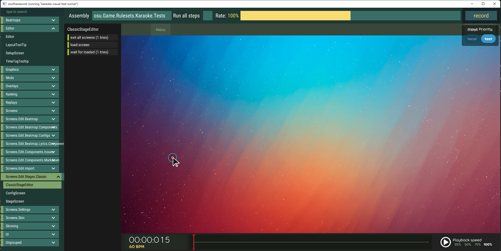
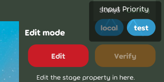
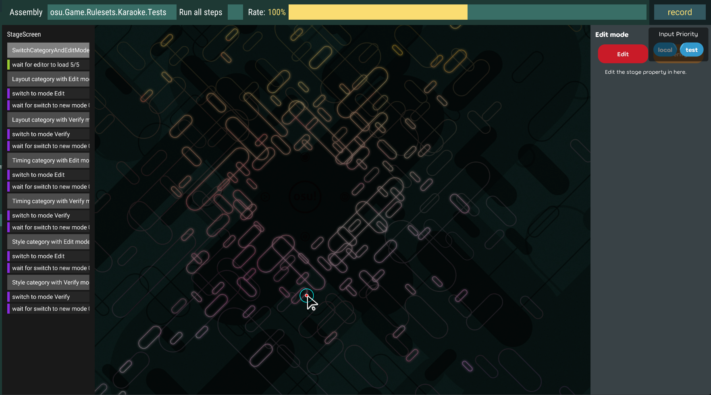
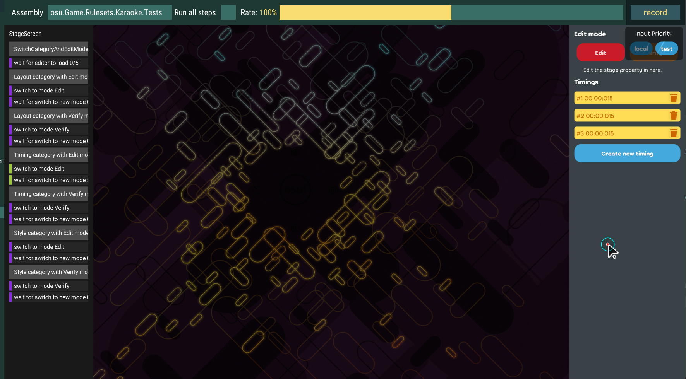

## Achievement

- Got a happy holiday.
- Still alive.
- Implement the stage structure for the karaoke beatmap. Will be easier to implement various of style.

## Beatmap

- Implement stage info for the karaoke beatmap.
  - Implement the base stage info for the beatmap. [karaoke](#1821@andy840119)
  - Make stage info more useful. [karaoke](#1823@andy840119)
  - Implement stage element category. [karaoke](#1824@andy840119)
  - Implement classic stage timing info. [karaoke](#1830@andy840119)
  - Refactor some parts in the stage categlry. [karaoke](#1832@andy840119)
  - Adjust timing info structure. Not store the lyric id directly in the timing point. [karaoke](#1836@andy840119)
  - Let property in the stage element become bindable. [karaoke](#1858@andy840119)
- Implement the note info metadata in the karaoke beatmap. [karaoke](#1855@andy840119)

## Code quality

- Regular clean-up code. [karaoke](#1819@andy840119)
- Fix the type. `Convertor` -> `Converter`. [karaoke](#1820@andy840119)
- Improve code quality in the change handler test. [karaoke](#1822@andy840119)
- Refactor editor verifier. [karaoke](#1841@andy840119)
- Fix some typos. [karaoke](#1849@andy840119)
- Use empty drawable instead of create empty container. [karaoke](#1851@andy840119)
- Collect `get karaoke beatmap from editor beatmap` logic. [karaoke](#1854@andy840119)

## Editor

- Implement some component able to edit or check the stage in the karaoke beatmap.
  - Implement classic stage changer handler. [karaoke](#1825@andy840119)
  - Implement classic layout checks. [karaoke](#1826@andy840119)
  - Implement time info change handler. [karaoke](#1831@andy840119)
  - Implement the check for timing info. [karaoke](#1837@andy840119)
- Also, we made the new screen for able to edit the stage.
  - Implement classic stage info editor. [karaoke](#1839@andy840119)  
    
  - Implement settings for stage editor screen. [karaoke](#1840@andy840119)  
    
  - Implement verify section into stage editor. [karaoke](#1843@andy840119)
  - Able to switch category and edit mode in test scene. [karaoke](#1844@andy840119)  
    
  - For able to show the list of items in the section, implement items editor as shared base class. [karaoke](#1845@andy840119)
  - Implement timing info section. [karaoke](#1846@andy840119)  
    
  - Implement the stage categories editor. [karaoke](#1852@andy840119)  
    
- Instead of writing the logic to get the timing info from the item(e.g. lyric) in the `Issue` class, should be better to get the time directly from the `Issue`. [karaoke](#1842@andy840119)
- Implement auto generator change handler interface for easily check which change handler able to auto-generate properties. [karaoke](#1848@andy840119)
- Change the exception message in the change handler. [karaoke](#1856@andy840119)
- Adjust change handler interface for able to change the mapping status by selected hit-objects in the editor beatmap. [karaoke](#1859@andy840119)

## UI/UX

- Add test scene for the issue icon, for able to easily see the issue icon. [karaoke](#1827@andy840119)

## Utility

- Implement compare utils for better to implement `IComparable<T>` interface for compare two objects. [karaoke](#1857@andy840119)
