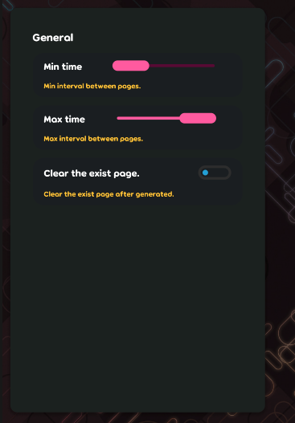

## Achievement
- Go to `CA` and come back.
- Company has a fall-guys event and still alive.
- Project need to re-write the shader. `Andy840119` and `WebFreak001` make the new shader for it.
- Figured out some features can be dropped but still playable(andy is happy now).

## Code quality
- Regular clean-up code. [karaoke](#1867@andy840119)
- Apply file scope to the test project. [karaoke](#1877@andy840119)

## Editor
- Implement basic check for the note info. [karaoke](#1860@andy840119)
- Implement component for able to switch the workspace. [karaoke](#1838@andy840119)
- Should not check the lyric's property in the note check. [karaoke](#1861@andy840119)
- Implement the checks for note's time. [karaoke](#1862#1863@andy840119)
- Auto-generate control component for the auto-generate config. Instead of writing lots of bindable, should be better auto-generate the controls for those properties. [karaoke](#1869@andy840119)
  
  - First step, Remove the auto-generator config dialog because will able to adjust the config only by popover. [karaoke](#1870@andy840119)
  - Mark the configurable property in the config, also, write the utils for able to generate the dictionary with category and list of configurable items for the config. [karaoke](#1871@andy840119)
  - Implement the extension for able to get all setting controls in the GeneratorConfig. [karaoke](#1872@andy840119)
  - Implement popover for able to auto-generate the control for the config. [karaoke](#1873@andy840119)
  - (Improvement) Should be able to get generator config just by type. [karaoke](#1874@andy840119)
- Use better way to make sure that working property is sync with the data property in the `Lyric` and `Note`.
  - Implement hit-object validator to check which property is invalid(need to update) in the beatmap processor. [karaoke](#1879@andy840119)
  - Change from `Validator` to `HitObjectWorkingPropertyValidator` in `Note and Lyric hit object. [karaoke](#1883#1885@andy840119)
  - Prevent assign `working property` that is not matched to the `data property`. Should always make sure that `working property` is the result that re-process from the `data property`. [karaoke](#1886@andy840119)
  - Should mark the page info in the `lyric`/`note` as invalid if edit the page. [karaoke](#1889#1880@andy840119)
  - Implement generic interface to invalidate the working property in the `lyric` or `note`. [karaoke](#1890@andy840119)
  - Expose get timing info from stage becaue need to assigh the lyric's `start` and `end` time from the classic stage ingo in the `bearmap processor`. [karaoke](#1891@andy840119)
  - Fix the validation logic. [karaoke](#1892@andy840119)
  - Implement inject working time. [karaoke](#1893@andy840119)
  - Should validate the property as default. [karaoke](#1894@andy840119)
  - Should mark the working property as valid if change the working property to the same as working property. [karaoke](#1895@andy840119)
  - Add `singer` working property in the `lyric`. [karaoke](#1896#1897@andy840119)
  - Use working singer property. [karaoke](#1903@andy840119)
  - `Change handler` should trigger `update hit-object in the beatmap(re-run beatmap processor for those hit-objects)` if needed. [karaoke](#1900#1902@andy840119)

## Framework
- Re-write the shaders for able to let it works on the `DirectX` or `Vulkan`.
  - Upgrade osu-framework package to the latest. [font-package](#322@andy840119)
  - Upgrade shaders to new spir-v and fix the broken shader. [font-package](#321@WebFreak001)
  - Fix multiple shader render issue. [font-package](#331@andy840119)
    - Fix weird lyric effect in the gameplay. [karaoke](#1783@andy840119)
  - Fix the shadow shader has different shadow direction if using different renderer. [font-package](#334@andy840119)

## Fix
- Upgrade the package to the latest and fix the shader issue.

## Testing
- Fix get the null reference issue if call `SetUpKaraokeBeatmap()` before `PrepareHitObject()`. [karaoke](#1898@andy840119)
- Make sure that `Update()` and `UpdateState()` is working in the `EditorBeatmp` with some editor-related test cases. [karaoke](#1899@andy840119)
- Adjust change handler assertion. [karaoke](#1901@andy840119)

## Tooling
- Leave message after upload the localization to the crowdin. [karaoke](#1833@andy840119)
