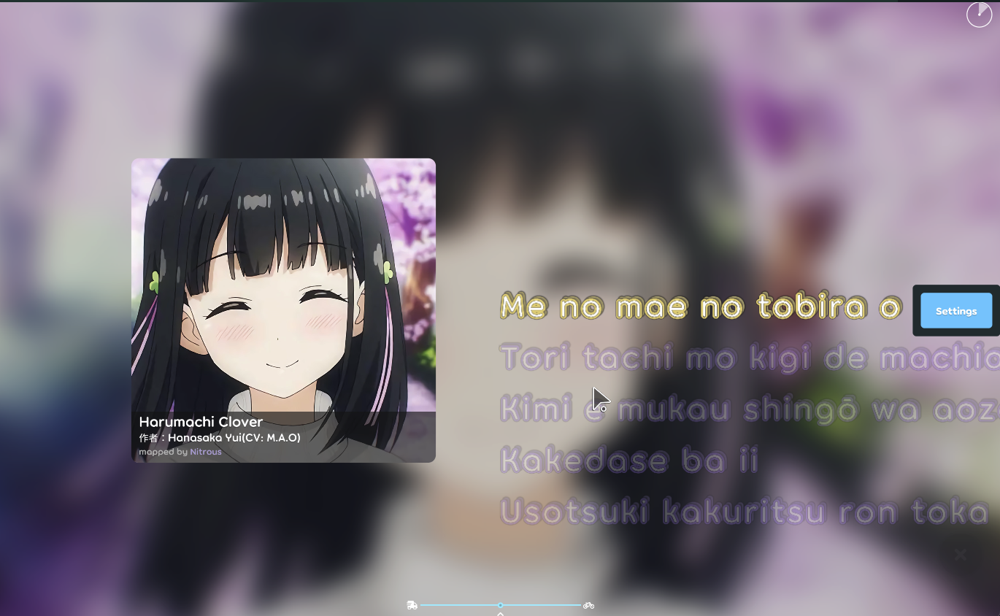
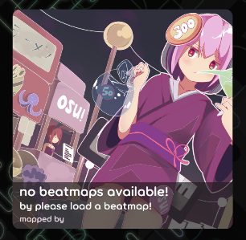

## Achievement
- Re-write some code to let the ruleset able to support different type of stage.
  
- Add three more stars in this proejct.
- Trying to reduce working hours but seems failed ;_;
- Not very sure, maybe andy and this project is full of mistake and there's no achievement actually.
- Add new stage section for the chagne log.

## Beatmap
- Move fill the working property method into the hit-object to make the `beatmap processor` simple. [karaoke](#1923@andy840119)
- Stage info can be invalidate in the editor. Means we can see the change in the editor if any property related to the stage changed. [karaoke](#1924@andy840119)

## Code quality
- Regular clean up code. [karaoke](#1911@andy840119)
- Convert to using declaration to make the CI happy. [karaoke](#1912@andy840119)    
  from:
  ```
  using (var sw = new StreamWriter(ms))
  {
    var encoder = new KaraokeLegacyBeatmapEncoder();
    string encodeResult = encoder.Encode(beatmap);
    sw.WriteLine(encodeResult);
  }
  ```
  to:
  ```
  using var sw = new StreamWriter(ms);

  var encoder = new KaraokeLegacyBeatmapEncoder();
  string encodeResult = encoder.Encode(beatmap);
  sw.WriteLine(encodeResult);
  ```
- Refactor the change handler test. [karaoke](#1917@andy840119)

## Setting
- Remove the font size adjustment in the config. [karaoke](#1945@andy840119)

## Stage
- Implement the base class for the stage element for collecting the shared info like `ID` and `Name`. [karaoke](#1913@andy840119)
- Should be able to clear the whole elements in the stage category. [karaoke](#1915@andy840119)
- Add `stage element` as working property in the `note` and the `lyric` for able to apply the stage effect in the `drawable lyric` easily. [karaoke](#1919@andy840119)
- Auto-create and initialize the beatmap stage if current stage in the beatmap is empty. [karaoke](#1922@andy840119)
- Implement base stage definition class. Technically, one stage info should only one stage definition to recording something like playfield size, lyric fading effect or anything related to the stage and can be configurable. [karaoke](#1925@andy840119)
- Add serializer for the preview stage info. [karaoke](#1926@andy840119)    
  Technically, we will not save the preview stage info info into the beatmap but still make the serializer.
- Should invalidate the stage elements working property in the beatmap processor if beatmap stage changed. [karaoke](#1928@andy840119)
- Implement stage effect applier for the note and the lyric. [karaoke](#1930@andy840119)    
  We need a class for able to convert the stage elements into the transformers that can affect the hit-object like adjust the lyric preempt effect or moving position.
- Define the interface for able to affect the drawable hit-object in the whole lifecycle. [karaoke](#1933@andy840119)    
  The `stage element` should be able to affect the `initial transformer`(the transformer when the drawable hit-object appear) , `start time transformer`(the transformer for the drawable hit-object's start time) and `hit state transformer`(the transformer for the drawable disappear).
- Add `preempt time` in the `lyric`/`note` because `state element` might affect the `preempt time` in the `drawable hit-object`. [karaoke](#1935@andy840119)
  - Preview stage timing calculator should consider about the `preempt time` also. [karaoke](#1936@andy840119)
  - Move preempt time into applier. Should be better to make the invalidate property in the hit-object simple. [karaoke](#1939@andy840119)
- Implement the playfield stage applier. [karaoke](#1938@andy840119)
  For able to adjust the property in the playfield like change the size or add the drawable.
- Introduce: Preview stage. [karaoke](#1906@andy840119)    
  Not much words to say, it's the new stage that can show the lyric and cover without mappers to create the stage.    
  Players can have a "playable" stage before the first stage(classic stage) editor created.
  - Create `PreviewStageInfo` class. [karaoke](#1916@andy840119)
  - Implement stage mods for able to force use the `preview stage` or `classic stage`. Will create the default stage in the mod if there's no matched stage in the beatmap. [karaoke](#1918@andy840119)
  - Implement preview stage timing calculator. [karaoke](#1931@andy840119)    
  We need a algorithm to calculate the timing lyric should be moved to the target of line.
  - Add more properties(e.g. fading duration and effect for the lyric) in the default stage definition. [karaoke](#1932@andy840119)
  - Let preview stage timing calculator support delay effect. [karaoke](#1934@andy840119)
  - Implement the preview stage's lyric transformer effect. [karaoke](#1937@andy840119)
  - Implement the drawable to show the beatmap cover and some basic info. [karaoke](#1940@andy840119)    
  
  - Should not use overlay colour in gameplay component(beatmap cover info). [karaoke](#1942@andy840119)
  - Implement the stage applier for the preview stage. [karaoke](#1943@andy840119)
  - Adjust the stage layout for the preview stage with scorable or non-scorable. [karaoke](#1944@andy840119)
  - Think about should change the lyric position by the playfield or applier if using the default stage info. [karaoke](#1910@andy840119)    
  The final answer is we should write more logic into the applier as possible.
  - Use applier in the `drawable lyric` and `playfield`. [karaoke](#1946@andy840119)    
  It's the final PR to make the `stage applier` or the `hit-object applier` works.