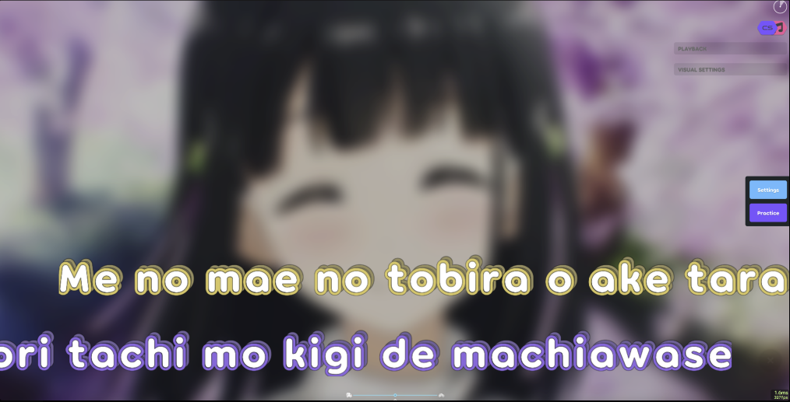
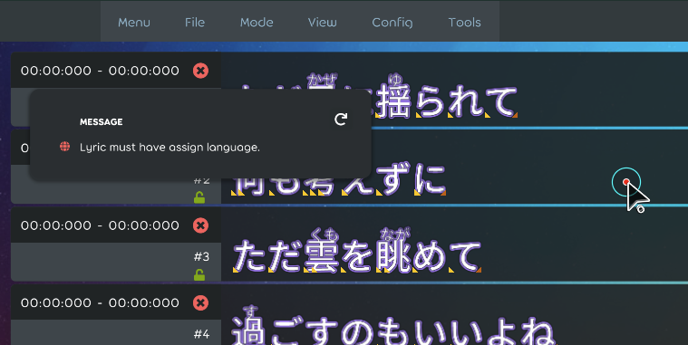
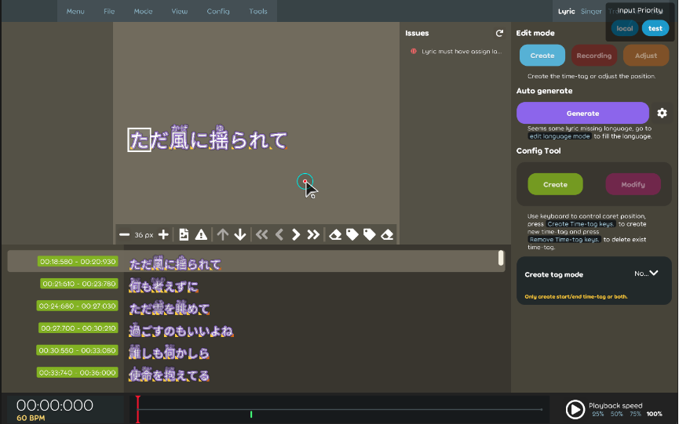

## Achievement

- Implement the mod for able to use different stage(e.g. works like the `japanese karaoke system` or like `lyric player`) in the gameplay.  
    
    
  
- Release new change log within two weeks.
- Happy work from home ended ;\_;
- 看起來年底的日本邊玩邊工作的計劃泡當了 QQ
- 是時候思考究竟要專心工作，還是專心去玩了。早上翻了一下以前寫的 changelog，發現這兩年感覺沒啥玩到，唉。

## Beatmap

- Should mark the working property to invalidate as default if the working property does not have the data property. [karaoke](#1953@andy840119)
- It's time to say goodbye for supporting the `Nicokara` file format. [karaoke](#1961@andy840119)

## Code quality

- Made some code clean-up. [karaoke](#1966@andy840119)
- Updating the whole project to use `File Scoped Namespaces`. [karaoke](#1754#1967@andy840119)
- Fix some wrong `Assert.IsNull(expected);` usage in the test case. [karaoke](#1657#1969@andy840119)
- Use utils to get the value by state. [karaoke](#1980@andy840119)  
  from:
  ```csharp
  var value =  state switch
  {
    TextIndex.IndexState.Start => startValue,
    TextIndex.IndexState.End => endValue,
    _ => throw new ArgumentOutOfRangeException(nameof(state))
  };
  ```
  to:
  ```csharp
  var value = TextIndexUtils.GetValueByState(textIndex, startValue, endValue);
  ```

## Editor

- Make the `generator selector` able to use in other generator like `stage generator`. [karaoke](#1948@andy840119)
- Implement the `stage info` generator selector. [karaoke](#1956@andy840119)
- Separate the auto-generate logic into each generator. Should not place all generator into single change handler. [karaoke](#1957#1958@andy840119)
- Adjust the interface in the stage change handler. [karaoke](#1959@andy840119)
- Remove the whole layout editor. Remove the old layout editor because every stage should have it's own layout editor if the stage is editable. [karaoke](#896#1963@andy840119)
- Able to see all the errors by clicking the invalid info icon. [karaoke](#1971#1975@andy840119)  
  
- Rename the drawable caret to let it match to the model name. [karaoke](#1976@andy840119)
- Fix the tiny bug in the text caret position algorithm. [karaoke](#1977@andy840119)
- Add the damn separators into the toolbar. [karaoke](#1979@andy840119)  
  
- Refactor caret position provide method in the `drawable lyric` for able to get the `lyric element` or `element position` directly. [karaoke](#1981@andy840119)  
  
- Rename karaoke sprite text component and give it an interface for only expose method for getting things. [karaoke](#1982@andy840119)
- Refactor drawable caret. [karaoke](#1983@andy840119)
- Re-design the caret algorithm for the create/remove time-tag mode. [karaoke](#1973#1984@andy840119)  
  

## Fix

- Fix changelog does not showing in the latest Lazer release. [karaoke](#1947@andy840119)

## Mods

- Adjust the mod interface inherit to make sure that will apply the mod before beatmap processor. [karaoke](#1954@andy840119)
- Should invalidate the working property in the mod because the stage will apply to the hit-object while selecting them in the song selection. [karaoke](#1878#1960@andy840119)

## Skinning

- Remove mapping role in the karaoke skin. Skin should only have feature to provide the config/resource by lookup. [karaoke](#1962@andy840119)
- Remove group from the skin. [karaoke](#902#1964@andy840119)
- Fix cannot entry to the gameplay if use legacy skin. [karaoke](#1506#1941#1965@andy840119)

## Stage

- Implement the timing point calculator for the classic stage info. [karaoke](#1949@andy840119)
- Implement the classic stage layout auto generator. [karaoke](#1950@andy840119)
- Implement stage info generator. [karaoke](#1952@andy840119)
- Implement classic stage applier. [karaoke](#1955@andy840119)
- Implement the classic stage auto-generator. [karaoke](#1764#1904@andy840119)
- Create the cover skin element. [karaoke](#1908@andy840119)
- Implement stage class as metadata in the karaoke beatmap. [karaoke](#1755@andy840119)

## Testing

- Rename the test method for providing the config to the generator. [karaoke](#1951@andy840119)

## Tooling

- Fix packing dlls does not include the localization file. [karaoke](#1865@andy840119)
