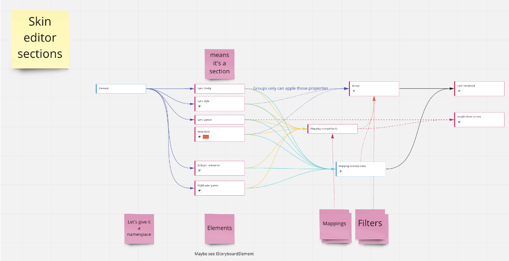

## Achievement

- 是時候該思考一下人生的未來了QQ
- Start new project for able to resolve leetcode question in the local environment.
- Let the caret position able to drag to `select`/`create` range of `lyric text`/`ruby tags`.
- Making ruleset's own primary key type to resolve duplicated `create new key number` logic.
- Closes issue `\No.1000 Created/`. [karaoke](#1000@andy840119)
  > Because no. 2000 issue/pr has been created.
- Change the primary key type for the object in this ruleset.

## Beatmap

- [Close duplicated] Write `karaoke`'s own `reference resolver`. [karaoke](#1108@andy840119)
  > because `karaoke beatmap processor` will fill all the reference value, So there's no need to implement it in the json beatmap.
- [Close duplicated] Link between lyric and note. [karaoke](#569@andy840119)
  > Already has better way to do that.
- [Close duplicated] Implement note checker. [karaoke](#565@andy840119)
  > Implemented already.
- Use `string with hex` format to replace the `number` format as primary key for the object in the karoake beatmap. [karaoke](#2045@andy840119)
  > The main benefit is that there's no need to write lots of logic to create the new primary key.
  - Change the `singer` primary id type. [karaoke](#2046@andy840119)
    - Singer extension should be able to accept the int number directly. [karaoke](#2047@andy840119)
    - Mark singer id as serializable. [karaoke](#2049@andy840119)
  - Change the `lyric` primary id type. [karaoke](#2055@andy840119)
    - Should change the id after `DeepClone()` the lyric. [karaoke](#2057@andy840119)
  - Change the `stage element` primary id type. [karaoke](#2061@andy840119)
  - Change the `timing point` primary id type. [karaoke](#2062@andy840119)
  - Fix `ElementIdConverter` does not accept the `nullable` property. [karaoke](#2051#2052@andy840119)
  - Some property like `element id` need extra convertor in the `DeepClone()` method. [karaoke](#2050#2053@andy840119)
  - Able to write the value into the property with protected/private setter. [karaoke](#2048@andy840119)
  - Add new method for able to get all matched `hit-object ids` in the `element category`. [karaoke](#2060@andy840119)

## Code quality

- Regular clean up code. [karaoke](#2035@andy840119)
- [Close duplicated] Remove all `AllowNull` attribute eventually. [karaoke](#1411@andy840119)
- Remove nullable disable annotation in the remaining class. [karaoke](#2041@andy840119)
- Move hit-object related `utils` into the `Objects` namespace. [karaoke](#2042#2043@andy840119)
- Use `IEnumerable` instead of `Array` to make the method more easy to override. [karaoke](#2044@andy840119)

## Editor

- Let caret position able to drag the range of the text.
  - Think about how pass the start and end index into the `IIndexCaretPositionAlgorithm`. [karaoke](#2019@andy840119)
  - Implement `create ruby caret position algorithm` for able to create the ruby by drag the range of the lyric text. [karaoke](#2023@andy840119)
  - Add `end index` to the `input caret position` for able to select the range of the lyric text. [karaoke](#2025@andy840119)
  - Fix dragging the caret might have performance issue. [karaoke](#2029@andy840119)
  - Add the release caret position to the caret state. [karaoke](#2030@andy840119)
  - Instead of add the end index to the `caret position`, might be better to have the release position in the `caret state`. [karaoke](#2027#2030@andy840119)
    > It means that we need to revert the change in the #2025, part of #2023 and #2022.
  - Refactor drawable caret layer for able to receive the release caret event. [karaoke](#2031@andy840119)
  - Refactor the drawable input caret. [karaoke](#2032@andy840119)
  - [Close duplicated] Implement select range of text in lyric editor. [karaoke](#321@andy840119)
  - [Close duplicated] Able right-click to create new ruby/romaji object. [karaoke](#618@andy840119)
    > Have better UX instead.
- Adjus the change handler. `ILyricTextChangeHandler` should be able to delete the range of the text. [karaoke](#2033@andy840119)
- [Close duplicated] Implement change handler method to offset the list of the lyrics. [karaoke](#1443@andy840119)

## Result

- Upgrade the package to the latest and adjust the result screen to aviod compile error. [karaoke](#2024@andy840119)  
  

## Skinning

- [Close duplicated] Apply new skin structure(old). [karaoke](#1073@andy840119)  
  
  > Close this issue because already come out better structure.
