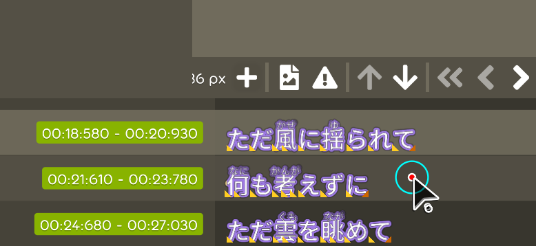
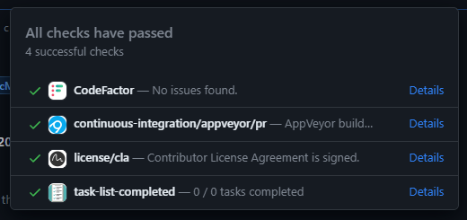

## Achievement

- Get a new PR from the new contributor.
- Add the `contributor guideline` and `lable` to let new contributor able to know which issue is friendly to resolve.
- Adjust the caret state interface for let it able to support select range of the index.

## Code quality

- Regular clean up code. [karaoke](#2108@andy840119)

## Editor

- Should be able to compare the caret position. [karaoke](#2094@andy840119)
  > Need to know that which of the caret position(`click-down` caret position or `drag` caret position) is in the left or right side.
- Rename property in caret state. [karaoke](#2095@andy840119)
  > Rename from `release caret position` into `dragging caret position`.
- Implement the drag range caret position interface. [karaoke](#2096@andy840119)
  > This interface is focus on provide the `click-down` and `drag` caret position.
- Handle the case if user use `kayboard` to adjust the caret position after select range of the index. [karaoke](#2098@andy840119)
  > Trying to follow the same behavior like how normal text editor did.
- Make typing caret draggable. [karaoke](#2099@andy840119)
- Rename edit mode enum. [karaoke](#2100#2102@andy840119)
  > `Edit mode` is too general, renamed it into `edit step`.
- Fix singer page cannot open in the production environment. [karaoke](#1146#2104@Joehuu)
- Move `switch create time tag caret mode` out of lyric editor config. [karaoke](#2109@andy840119)
  > This "edit state" does not need to save as user preference.
- Implement the `sub-section` for able to switch the edit mode in the lyric editor. [karaoke](#2110#2111@andy840119)  
  
  > This sub-section able to show the switch state button with description.
- Should be able to drag the main lyric text to generate the ruby text. [karaoke](#2112#2115@andy840119)  
  
- Moving index caret position should be only in the editable lyric. [karaoke](#2114@andy840119)  
  
  > Should not change the caret index in here.
- [outdated] Should be able drag to select the lyric text in the typing. [karaoke](#2008@andy840119)

## Fix

- [outdated] Refactor the issue tooltip.
- Fix drag in range of text in the lyric editor might have performance issue. [karaoke](#2119#2120@andy840119)

## Tooling

- Add contribution guideline. [karaoke](#2107@andy840119)
- Add CLA agreement to the new contributor. [karaoke](#2084@andy840119)  
  
  > Need to make sure that all source code from the contributor does not have legal issue to affect the current user.
- Add contribution guideline to let new contributor able to know what they can do to let their code more easier to be merged. [karaoke](#2106@andy840119)

## Stage

- Implement base class for the stage element generator. [karaoke](#2088@andy840119)
- Move stage into individual namespace. [karaoke](#2089@andy840119)
  > Stage should not be the part of metadata in the beatmap eventually.
