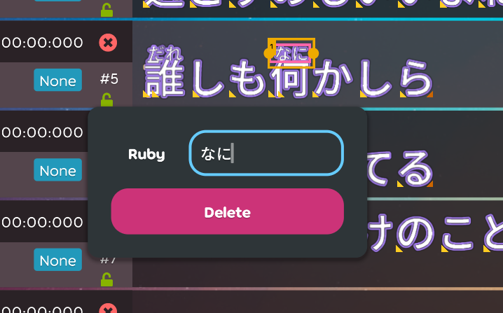
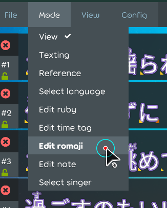

## Achievement

- Not quit the job yet to make the manager happy.
- Rewrite some test cases to make the proejct happy.
- Buy a translation pen to make me happy.

## Code quality

- Regular clean up code. [karaoke](#2130@andy840119)

## Editor

- Let lyric editor able to drag the range of the text to create the ruby. [karaoke](#2007@andy840119)
  - Adjust lyric caret state brhavior for more assertion. [karaoke](#2123@andy840119)
  - Add `StartDragging()` and `EndDragging()` for the `LyricCaretState.cs`. [karaoke](#2124@andy840119)
  - Change the drag caret position will not change the caret position. [karaoke](#2125@andy840119)
    ```
    CraetPosition will have value only click the lyrc.
    RangeCaretPosition will have value only if drag inside the lyric.
    ```
  - Implement create ruby tag popover. [karaoke](#2126@andy840119)
    
  - Remove create ruby/romaji button. [karaoke](#2128@andy840119)
  - Improvement UX part of create ruby text popover. [karaoke](#2129@andy840119)
    ```
    1. Should not have default ruby text text, using placeholder instead.
    2. Should not be possible to create the ruby text with empty text.
    ```
  - Create popover for able to edit ruby text. [karaoke](#2131@andy840119)
    
  - Adjust popover position. [karaoke](#2132@andy840119)
- [WIP] Start moving romaji inside the time-tag. [karaoke](#2004@andy840119)
  - Ruby mode should after time tag mode. [karaoke](#2134@andy840119)
    
  - Implement the change handler for able to generate properties from lyric. [karaoke](#2133@andy840119)
    ```
    Because current change handler architecture does not support generate time-tag and romaji inside the time-tag at the same change handler.
    ```
  - Add time-tag romaji generator into generator change handler. [karaoke](#2135@andy840119)
  - Editor should edit the romaji property inside the time-tag. [karaoke](#2136@andy840119)
  - Fix the lyric import step broken. [karaoke](#2137@andy840119)
  - Remove old romaji generator. [karaoke](#2138@andy840119)
  - Remove old romaji change handler. [karaoke](#2139@andy840119)
  - Remove old romaji check. [karaoke](#2140@andy840119)

## Fix

- Fix invalid culture code cause cannot load the ruleset. [karaoke](#2141#2142@andy840119)

## Testing

- Rewrite the `LyricCaretStateTest` for testing the behavior as different aspect. [karaoke](#2118#2122@andy840119)

## Utility

- Add utility to check is latin. [karaoke](#2146@andy840119)
  ```
  Romanized lyrics should be all latin cnaracters.
  ```
