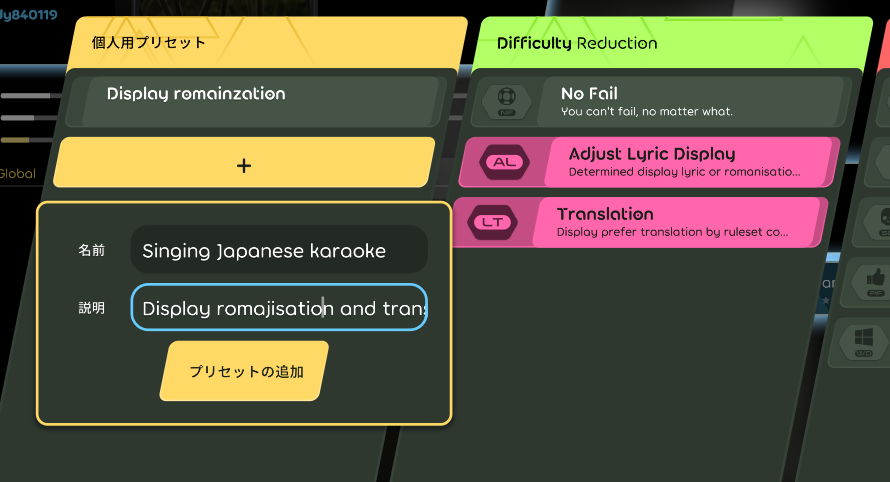
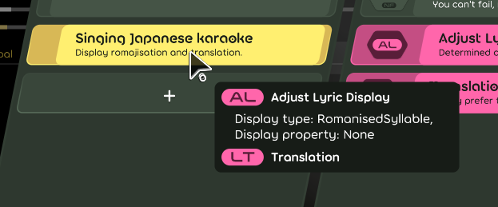
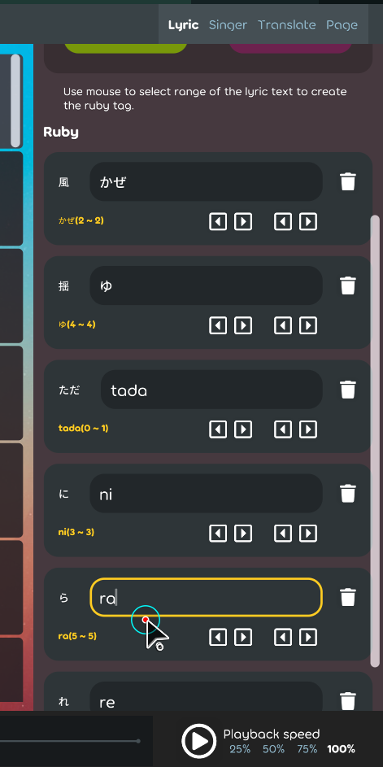

## Achievement

- Already bought lots of anime blu-ray online and seems hard to stop buying ;\_;
- Have little bit more time on this project for refactoring.
- It's able to generate the badge for disaplay the githug repo star number in the [shields.io](https://shields.io/badges/git-hub-repo-stars)

## Code quality

- Refactor the menu item for dealing with some binding event. [karaoke](#2173@andy840119)  
  
- Rename this menu item and should not be abstract. [karaoke](#2174@andy840119)
- Refactor the object for display the lyric text. [karaoke](#2175@andy840119)
- Sync the project dotnet setting from lazer. [karaoke](#2179@andy840119)
- Refactor the code in the bindable namespace. [karaoke](#2181@andy840119)
- Finally rename all `Romaji` to `Romanisation` in the whole project. [karaoke](#2145@andy840119)

  > Because "romaji" is only used in Japan.
  > Also, romanised syllable will inside the time-tag to make sure that display romanisation will be OK.

  - `Romanization` to `Romanisation` for following lazer use `UK` english. [karaoke](#2180@andy840119)
  - `Romani` to `romanization` in the lyric editor. [karaoke](#2182#2183@andy840119)
  - `Romani` to `romanization` in the issue template. [karaoke](#2184@andy840119)
  - `Romani` to `romanization` in the generator. [karaoke](#2187@andy840119)
  - Rename the remaining `romaji` wording. [karaoke](#2188@andy840119)
  - Remove `romaji` wording in import lyric screen. [karaoke](#2189@andy840119)
  - Add missing binding for `romanization` in the time-tag. [karaoke](#2192@andy840119)
  - Remove the `romaji tag property from the lyric. [karaoke](#2193@andy840119)
  - Rename remaining romaji to romanisation. [karaoke](#2196@andy840119)

- Remove the `text-tag` interface.

  > Because `ruby-tag` and `romaji-tag` inherit it before, but `romaji-tag` say goodbye to us.

  - Rename all the `text-tag` relate utility/method into `ruby-tag`. [karaoke](#2194@andy840119)
  - Remove the text-tag interface. [karaoke](#2195@andy840119)

- Move some adjustment from system config to mod.  
    
  

  > There's some reason for it:
  >
  > 1. Because lazer has mod preset. And mod preset can record the config.
  > 2. User might change the config frequently if they want to try different language of karaoke beatmap. Use mod seems much suitable.
  > 3. Anything that change the difficulty(e.g. use romanisation or adjust the tone) should be made as mod, or the adjustment need to be recorded into replay.
  > 4. Most of the time user did not change display lyric type or show/hide the translation while singing. Make it as mod can reduce the effort of dealing with binding events or re-calculation.

  - Move the display type/property from config into mode. [karaoke](#2199@andy840119)
  - Move the display translation/prefer language from config into mode. [karaoke](#2201@andy840119)

## Editor

- Make the focused textbox always visible at the right side if press tab to switch the focused textbox. [karaoke](#2205@andy840119)  
  
- Improve romanisation edit mode. [karaoke](#2206@andy840119)

## Utility

- (WIP) Implement the processor for able to config the lyric display type or property. [karaoke](#2176@andy840119)

  > Means it's possible to display the romaised lyric at the center of the text, or show/hide the ruby/romanisation at the top or bottom.

    
  

- Fix the logic in the processor. [karaoke](#2204@andy840119)
