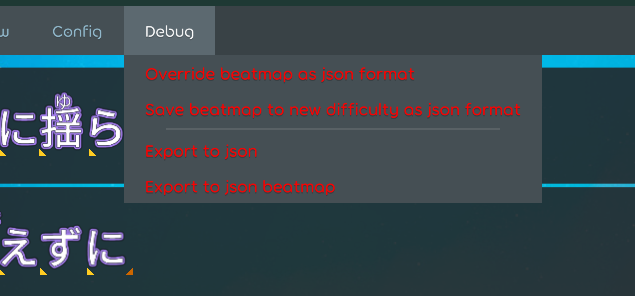
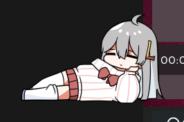
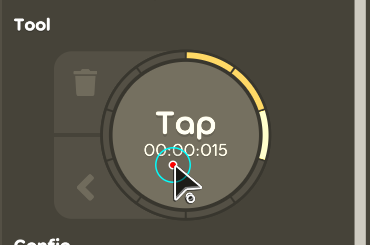
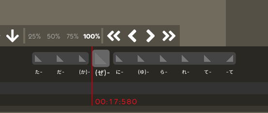
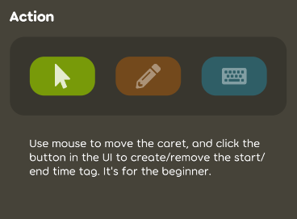
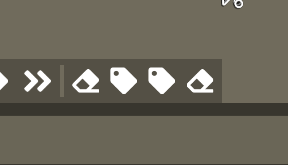
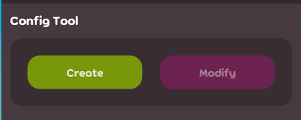

## Achievement

- Able to save the beatmap for debug purpose.  
  
- Improve `recording time-tag` experiance in the lyric editor
- Improve `create/remove time-tag` experiance in the lyric editor.
- Add the `architecture test` for this project.
- Start feeding this pet again.  
  

## ARC

- Add the `architecture test` for this project. [karaoke](#2232@andy840119)
- Add more strict check about test assert usage and naming. [karaoke](#2234@andy840119)

## Beatmap

- Lyric start/end time should be `nullable` if there's no time-tag with time in the lyric. [karaoke](#2221@andy840119)

## Code quality

- Prevent using `*component = *namespace` as possible. [karaoke](#2240@andy840119)

## Editor

- Fix note popover cannot pop-up in the main editor. [karaoke](#2011#2210@andy840119)
- Should be able to save beatmap into json format in the editor. [karaoke](#2211#2212@andy840119)
  > For debug purpose, still need to wait lazer provider official save/load method and official format.
- Refactor the import screen stack. [karaoke](#2215@andy840119)
- Migrate the import lyric header to the new style. [karaoke](#2214#2216#2218@andy840119)  
  
- Implement the drawable for the time-tag object. [karaoke](#2226@andy840119)
  > We need an drawable to show the time-tag staus like it's start or end time-tag, has time or not.
  > And it has tooltip to display those infos as default.
- Improvement of time-tag recording mode in the lyric editor. [karaoke](#2207@andy840119)
  > The main improvement is to let user easy to know which time-tag they are recording, and what's the next one.
  - Implement `drawable caret` to show how many time-tags in the character. [karaoke](#2219@andy840119)  
    
  - Implement this cool tap area for the recording mode. [karaoke](#2222@andy840119)  
    
  - Let the tap area able to show the time-tag amount in the focused lyric. [karaoke](#2223@andy840119)  
    
  - Improve `recording timeline area`. For now, it's able to see the focused time-tag and which time-tag has no time. [karaoke](#2224@andy840119)  
    
- Improve experiance for create/remove the time-tag in the lyric editor. [karaoke](#2225@andy840119)

  > The main issue is that user might know how to create the time-tag if there's no UI, and there's no easy to konw how may time-tag is attached to the character.
  > So we create the UI for time-tag visualization, and user is able to create/remove the time-tag by click the create button in the UI.
  > Also, we adjust the flow to indicate user to create/remove the time-tag by keyborad because it's much more faster.

  - Able to create/remove the caret by UI. [karaoke](#2227@andy840119)

    > I know it's ugly, but I'm not good at UX ;\_;

    

  - Remove modify time tag mode because it's not that useful. [karaoke](#2239@andy840119)

- Use tab control for the edit step section in the lyric editor.
  > So the header will be fixed at the top.
  - Re-write the header for the edit section. [karaoke](#2230#2236@andy840119)  
    
  - Because tab control provide the bindable, so just use the bindable to get/set the current edit mode. [karaoke](#2237@andy840119)
  - Implement switch create type section. [karaoke](#2242@andy840119)  
    
  - Remove the create/remove time-tag button in the toolbar because it's not useful. [karaoke](#2243@andy840119)  
    
- Let the selection in the lyric editor use the tab control.

  > All the single selection area in the lyric editor should use tab control.

  

  - Make switch sub-section component. [karaoke](#2241@andy840119)

## Fix

- Fix lyric text might not display well at some cases. [karaoke](#2209@andy840119)
- Small bug-fix. [karaoke](#2238@andy840119)
