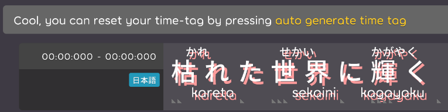
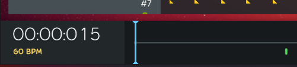
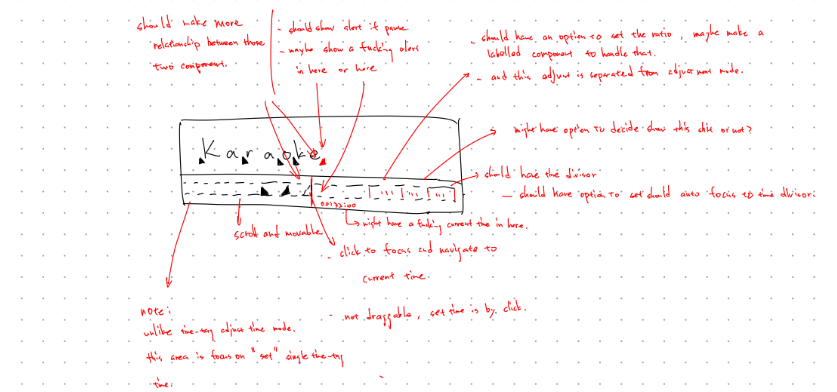
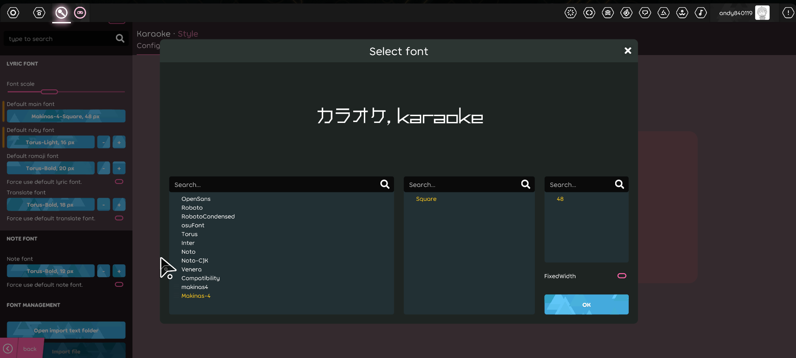

## Achievement

- Go to thailand on week.
- ~~Unlimitd weeds.~~
- Create [project board](https://github.com/orgs/karaoke-dev/projects/2) for able to see what's next.
- Adjust folder structure in the lyric editor for able to let it easier to be maintained/add more things.
- Improve the UI/UX in the compose lyric mode, see "[Improve the preview lyric area](https://github.com/karaoke-dev/karaoke/discussions/2245)" and "[Refactor the EditableLyric in the lyric editor](https://github.com/karaoke-dev/karaoke/discussions/2258)".
- Fix the [time-tag parsing issue](https://github.com/karaoke-dev/LrcParser/issues/40) in the [LrcParser](https://github.com/karaoke-dev/LrcParser)
  > It's a very simple project for able to read/write the `.lrc` file, but it parse the `.kar` file actually.  
  > So need to re-write another parser for the real [.lrc and it's A2 extension friend](<https://en.wikipedia.org/wiki/LRC_(file_format)>)
- Close lots of damn old issues.

## Beatmap

- Time to close old issues
  - [outdated] Let user easy understand mapping between kanji(lyric text or main text) and romanization. [karaoke](#352@andy840119)  
    
  - [outdated] Create karaoke beatmap `encoder`/`decoder` for testing purpose. [karaoke](#404@andy840119)
  - [outdated] Fix the json beatmap cannot save property in the karaoke beatmap. [karaoke](#1147@andy840119)
  - [outdated] Move the romanization into the time-tag. [karaoke](#2004@andy840119)
    > It's moved for a while.

## Code quality

- Rename from `translate` to `translation(s)` everywhere. [karaoke](#2252#2253@andy840119)
  > Because translate is a verb and translation is noun.
- Make some UI-related components inherit the `CompositeDrawable` instead of `Container`. [karaoke](#2255@andy840119)
  > If the component inherit the `Container`, means it's allow add child components to itself outside.
- Remove `HasFlagFast()` extension, restore `Enum.HasFlag()`. [karaoke](#2250@andy840119)
  > Follow how [o!f did](https://github.com/ppy/osu-framework/pull/6324/files).
- Upgrade csharp language version to 12. [karaoke](#2266@andy840119)
  > Still follow how [lazer did](https://github.com/ppy/osu/pull/26957/files).
- Time to close old issues
  - [outdated] Ignore some warning in project. [karaoke](#318@andy840119)

## Editor

- Adjust folder structure in the lyric editor
  - Remove the `LyricEditorLayout.Preview` / `LyricEditorLayout.Detail` into `LyricEditorLayout.List` / `LyricEditorLayout.Compose` to make it easier to understand. [karaoke](#2247@andy840119)
  - Adjust lyric editor content folder structure. [karaoke](#2254@andy840119)
  - Make the code quality better in the lyric editor content. [karaoke](#2256@andy840119)
  - Move `PreviewKaraokeSpriteText` into the child of LyricLayer. [karaoke](#2271@andy840119)
- Create bottom bar for the lyric editor. [karaoke](#2251@andy840119)  
  
- Make `preview lyric` (named `InteractableLyric`) in the lyric editor more flexible. [karaoke](#2261@andy840119)
  > It has multiple of layers and it's possible to decide which layer will be used outside.
  - Restrict hover y position in lyric provider. [karaoke](#2272@andy840119)
  - Add test case for this class. [karaoke](#2273@andy840119)
  - Make the idol/hover caret looks better. [karaoke](#2277@andy840119)
- Improve the UI/UX in the compose lyric mode
  - Add grid layout in the lyric compose mode. [karaoke](#2265@andy840119)  
    
  - Fix preview lyric not change the size if size changed. [karaoke](#2275@andy840119)
  - Able to drag the lyric in the composer. [karaoke](#2276@andy840119)
- Refactor toolbar button inherition in the lyric compose mode. [karaoke](#2274@andy840119)
- Time to close old issues
  - [outdated] Implement the compose area in the lyric editor. [karaoke](#1609@andy840119)
  - [outdated] Enable to switch the main text position between romanization and main text. [karaoke](#319@andy840119)
  - [outdated] Make editor config has visualization area. [karaoke](#377@andy840119)
    > Close this issue because it's super wasting time to make the preview area.
  - [outdated] Show alert checker in lyric editor. [karaoke](#751@andy840119)
    > Damn old issue.
  - [outdated] Make action button for the compose mode in the lyric editor. [karaoke](#1610@andy840119)
  - [outdated] Improve extra recording mode area in lyric editor. [karaoke](#1610@andy840119)
    
  - [outdated] Let user able to adjust time-tag time precisely. [karaoke](#604@andy840119)
  - [outdated] Implement tap area in the recording mode. [karaoke](#1143@andy840119)
  - [outdated] Fix cannot import the lyric due to missing depenedency [karaoke](#1510@andy840119)
    > Not very sure but i guess it should be fixed.
  - [rejected] Let user able to drag to change the time-tag index. [karaoke](#1168#1447@andy840119)
    > It might let user feel confused. Just delete the time-tag and re-create one.
  - [outdated] Add test case for the change handler that will modify the property in the karaoke metadata(e.g. translation or singer info) [karaoke](#1122@andy840119)
  - [outdated] Create the toolbar that able to show the move caret action in the compse mode in the lyric editor. [karaoke](#1974@andy840119)
  - [outdated] Implement page (or maybe called breath) edit mode in the lyric editor. [karaoke](#1766@andy840119)
    > Implemented, but might not be open that soom. Can just ignore this editor.
  - [outdated] Fix some issues in the lyric import screen. [karaoke](#1257@andy840119)
    > This should be fixed i think.
  - [outdated] Move LyricCheckerManager for lyric editor only? [karaoke](#1030@andy840119)
    > It's named `LyricEditorVerifier` or `PageEditorVerifier` (by different screen)
    > And it's belongs to it's own editor.
  - [outdated] Implement new area to batch adjust the lyric start/end time. [karaoke](#1252@andy840119)
    > This issue can be closed because lyric's start/end time is affected by stage.
    > If the classic stage is created, it should be possible to adjust the time.
  - [outdated] Use `SettingSource` in some editor or generator config. [karaoke](#1211@andy840119)
    > Implemented in the [#1871](https://github.com/karaoke-dev/karaoke/pull/1871) and [#1873](https://github.com/karaoke-dev/karaoke/pull/1873)

## Fix

- Fix ruby blueprint has select issue in the lyric editor. [karaoke](#2259#2260@andy840119)
- Replace all the `.lrc` file support to `.kar` by following the `LrcParser` changes [karaoke](#2231#2268@andy840119)

## Gameplay

- Time to close old issues
  - [outdated] Hide `ruby`/`romaji`/`translate` config if the user hides them? [karaoke](#853@andy840119)
    > It's possible to hide them via mod.

## UI/UX

- Time to close old issues
  - [outdated] Font selection improvement. [karaoke](#804@andy840119)
    
