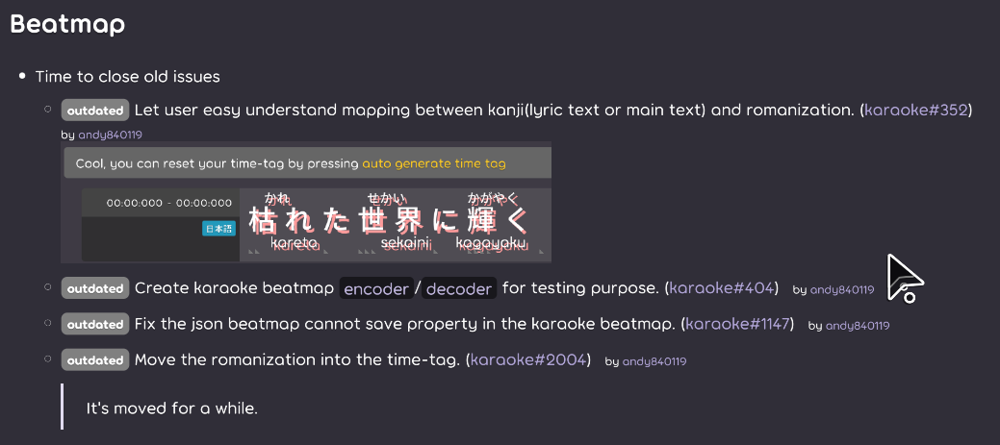
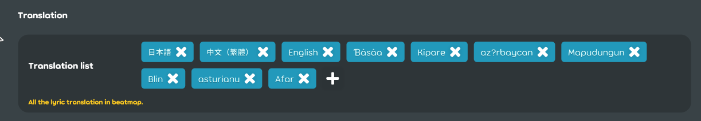
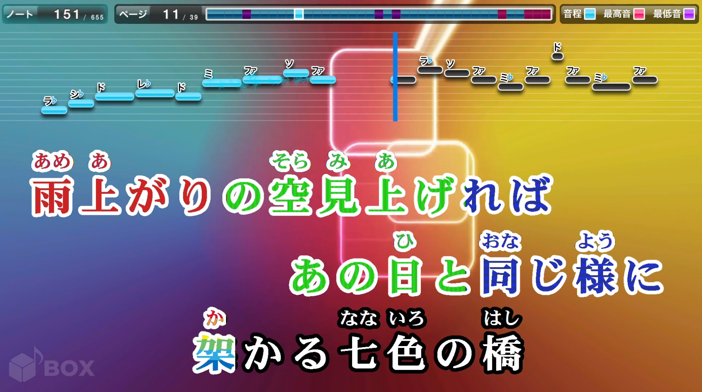
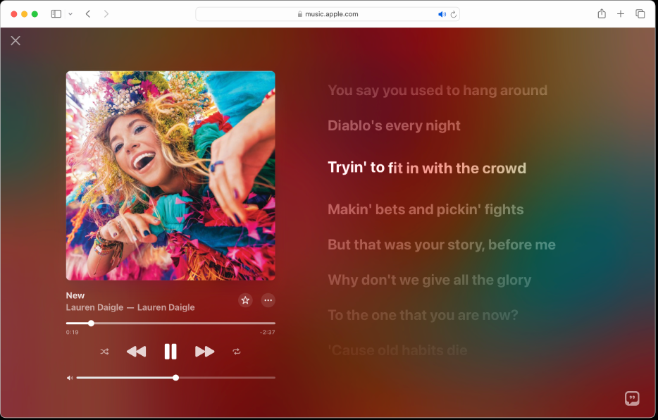

## Achievement

- Re-implement the stage system.
  - Use command to adjust the lyric's transformer like how storyboard did.
  - Separate the stage from the beatmap.
- Planning 2-weeks december vacation.
  - Stay at Osaka and Kyoto for few days and trying to servival.
  - Work few days at Tokyo.
  - Go to Comiket.
  - Give some weird meat a try.
  - Skiing for 5 days.
- Remember update the changelog.

## Blog

- Add special badge at the start of the changelog item. [karaoke](#2279#2281@andy840119)
  

## Code quality

- Rename from "language" to "translation" in some classes. [karaoke](#2282@andy840119)
- Regular clean-up code. [karaoke](#2288@andy840119)

## Editor

- Add translation edit section to the editor. [karaoke](#2284@andy840119)
  
- Add karaoke-specific sections to setup screen. [karaoke](#836@andy840119)
  - Separate singer and singer state into different list. [karaoke](#2289@andy840119)
  - Improve singer section. [karaoke](#2290@andy840119)

## Gameplay

- Fix note judgement cause exception. [karaoke](#2293#2295@andy840119)

## Stage

Guess it's time to explain why changelog not update so long.  
Before that, lets talking about what is `Stage` first.

`Stage` is a system to give the effect to the lyric. For example:

It's a very classic Japanese lyric arrangement.  
It has usually 2~4 lines of lyric at the screen.  
Each lyric can be padding to left/center/right.
If the lyric is end, the next lyric will take over it's position immediately.

And here's the lyric arrangement that apple music use.  
The current lyric at the center, if the lyric is end, next lyric will move to the center to replace the old one.

In order to add more type of stage arrangement in the future. e.g., let user able to edit the lyric's position and appear/disappear time.  
The stage system should be flexible.

And stage system should have those features:

- It can assign the lyric's actual Start/End time in the playfield.
- Change the property in the lyric to adjust the position. e.g. Position, margin and padding.
- Change the property in the lyric like drawable. e.g. Scale and alpha.
- Add custom element to the playfield. e.g. beatmap info preview.
- (TBD) Change lyric's font.
- (TBD) Change lyric's shader effect.

And [here's the system desing](https://app.affine.pro/workspace/40306a8a-6c73-4c99-a961-4f928980ef42/uso65AOQC3Hhn3Fs7wh8n)  
Thanks to the affine, it's a open-source platform that able to write the doc and graph.
~~It has few bugs while undo/redo but still worth to give it a try.~~

And here's the milestone, the re-implement plan is tracked in [this issue](https://github.com/karaoke-dev/karaoke/issues/2090)

- M0 - Preparation
  - Move the stage-related class from beatmap namespace into it's own namespace. [karaoke](#2089@andy840119)
  - Adjust the folder structure in the stage namespace. [karaoke](#2297@andy840119)
  - System desing for the new stage menegement system. [karaoke](#2244#2294@andy840119)
- M1 - Create the transformer command generator
  > Before:  
  > Implement the transformer action for different type of stage.  
  > After:  
  > Let stage generate transformer command, and provide the same command executer to execute all transformer command that generated from any type of stage.  
  > Benefit:  
  > Make the system more fiexible, and easier to maintain.
  - Create the command generator for the hit-object. [karaoke](#2296@andy840119)
  - Create the command generator for the playfield. [karaoke](#2303@andy840119)
  - Create the command generator for the create custom element in the gameplay. [karaoke](#2304@andy840119)
- M2 - Create the drawable stage environment
  > It's a wrapper for able to provide the necessary resource for lyric/playfield.  
  > e.g. DI that able to execute the transformer command.  
  > Design is inspired from the `DrawableStoryboard` in lazer.
  - Create the drawable stage. [karaoke](#2301@andy840119)
  - Create the stage-related injections. [karaoke](#2296#2301@andy840119)
- M3 - Not provide state-related properties by the beatmap
  > It's time to separate the stage system form the beatmap.
  - Able to control lyric's stage/end time by stage and drawable layer. [karaoke](#2298@andy840119)
  - Remove the old hit-object applier from the beatmap. [karaoke](#2301@andy840119)
  - emove the old playfield applier from the beatmap. [karaoke](#2303#2304@andy840119)
- M4 - Refactor
  - Refactor the interface in the stage namespace. [karaoke](#2302@andy840119)
  - Remove the stage info list in the beatmap. [karaoke](#2305@andy840119)
  - Remove the current stage info in the beatmap. [karaoke](#2305@andy840119)
