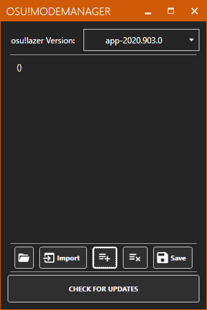
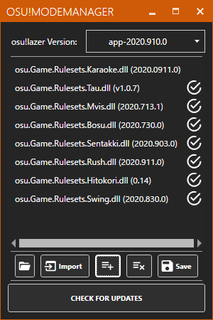
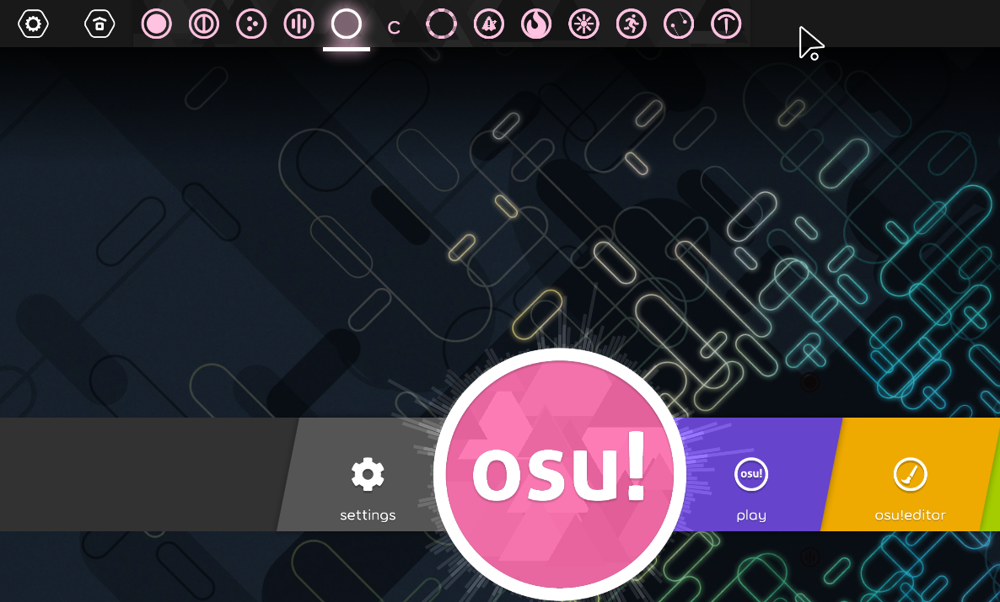
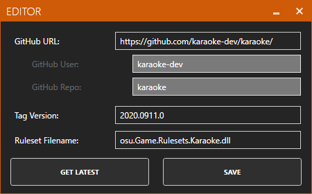

# How to install

## All install ways

If you are linux or osx user, you can copy `.dll` from [release page](https://github.com/karaoke-dev/karaoke/releases) like [other ruleset do](https://github.com/LumpBloom7/sentakki/wiki/Ruleset-installation-guide).

But if you are windows user, i recommend you use [Osu-ModeManager](https://github.com/starflash-studios/Osu-ModeManager) to `get`/`update` ruleset.

.

## Osu-ModeManager

1. If you are trying to use [Osu-ModeManager](https://github.com/starflash-studios/Osu-ModeManager/releases), download latest ruleset from [release page](https://github.com/starflash-studios/Osu-ModeManager/releases).

2. Download sample ruleset list from [here](res/osu.Game.Rulesets.List.txt), so you don't need to add it manually.

3. Open this program and login with your github account.    
 

4. Select the `latest` lazer version you install, e.g : `app-2020.0903.0`.    

5. Press `Import` to import `source list` download before.    

6. Then press `check for updates`, then download ruleset.    

7. Open your lazer client, then enjoy customize ruleset.    

8. You can add another ruleset by yourself, but be careful url should be end of `/`, like : https://github.com/karaoke-dev/karaoke`/`    

.

## Notice

- Remember re-update ruleset if new lazer client has been updated.
- If placing some ruleset's `.dll` in `%AppData%/osu!/rulesets` before, please remove them first.